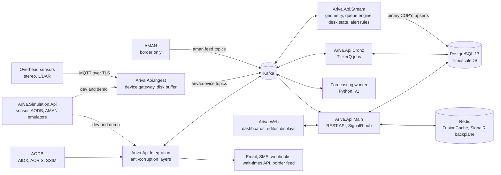

# Ariva architecture overview

Ariva is Dalil Tech's airport queue management system. It measures people anonymously from above, turns their tracks into queue counts and desk states, runs a small queue model forward to predict waits and recommend staffing, and evaluates service levels and penalties from versioned, revisable definitions.

This document condenses three approved design documents (D4 How It Works, D5 Technical Architecture, D6 Roadmap, all dated 2026-09-28) and the decisions made up to 2026-10-01. Where a later decision overrides a source, this document follows the decision and says so. Exact computations live in [../domain/formulas.md](../domain/formulas.md); terms in [../domain/glossary.md](../domain/glossary.md); the AMAN boundary in [../domain/data-boundary.md](../domain/data-boundary.md); decisions in [adr/README.md](adr/README.md) and [../product/decisions.md](../product/decisions.md).

Status labels used below: **Decided** (in a source or a later decision), **Proposed** (a design proposal in this repository, not yet confirmed), **To confirm** (open, needs an answer from the client, a vendor, counsel or the product owner).

## 1. Design rules

1. Ariva owns zone geometry. Tracks come in; lines and zones are Ariva's versioned data. Vendors stay swappable and disputed days can be recomputed.
2. Continuity by overlapping coverage, never by re-identification. Nothing biometric enters the system.
3. Two wait numbers: realised wait (exact, late, attributed to the entry interval, used for reports and penalties) and nowcast (immediate, modelled, used for screens and alerts).
4. Degrade and flag, never guess silently. Every number carries a data-quality flag and the zone profile version it was computed with.
5. Separate border and airport deployments at a combined site, with a one-way aggregate feed from border to airport. Officer-level data stays in AMAN.
6. On-prem first. Real-time measurement never depends on a WAN.

## 2. System context

Two modules, sold separately (Decided): the **Border module** for border authorities and the **Airport Operations module** for airport operators. Both run on the same core. Each is installed as its own deployment.

| Actor or system | Direction | What flows | Where |
|---|---|---|---|
| Overhead sensors (3D stereo, LiDAR perception platforms) | In | Anonymous track samples, device health, optional vendor line crossings | Sensor VLAN, through the device gateway (Ariva.Api.Ingest) |
| AMAN | In | Four aggregate-only feed contracts (V1) | Border deployment only, Kafka topics `aman.feed.<contract>.v1` |
| AODB (AIDX, ACRIS, vendor AODBs such as SITA or Amadeus) | In | Flight schedule, estimates, on-blocks, stands, passenger counts, desk allocations | Ariva.Api.Integration; mocked during development |
| Schedule files (SSIM) and load messages | In | Season schedules, on-board counts | Ariva.Api.Integration (file import) |
| Common-use check-in (CUPPS) logins | In | Agent sign-in and transactions | Airport deployment, v1 |
| Supervisors, duty managers, handler station managers | Both | Dashboards, alerts, configuration, disputes | Ariva.Web through the ingress |
| Passenger displays and signage CMS | Out | Banded nowcast per display channel | Read-only endpoint on the display VLAN |
| Email, SMS, webhooks, operations centre | Out | Alert notifications (email is the record, not the trigger) | Ariva.Api.Integration |
| Airport apps, FIDS vendors, SITA platform at AUH | Out | ACRIS-style wait-times API, webhooks, Kafka or bulk export of aggregates | Ariva.Api.Integration |
| Airport deployment (from a border deployment) | Out | Lane-level wait times and KPIs only, pushed one way | Border-to-airport aggregate feed |
| Identity provider (bundled Keycloak or the client's) | In | OIDC tokens | All APIs |
| Dalil support tooling | Out | Health telemetry only, where the client allows | Never operational data |

## 3. Components and hosts

The repository mirrors AMAN's layout (see [ADR-0016](adr/ADR-0016-repository-mirrors-aman.md)). Ports are in the 510xx range, distinct from AMAN's 500xx.

| Project | Path | Port | Role |
|---|---|---|---|
| Ariva.Utilities | Platform/Backplane | | Shared helpers with no domain knowledge |
| Ariva.Core | Platform/Backplane | | Onion core: domain entities, value objects, domain events, service interfaces, persisted workflow state machines, the formulas in pure functions |
| Ariva.Resources | Platform/Backplane | | Localised strings (Arabic, English, Portuguese, Swahili) |
| Ariva.Infra | Platform/Backplane | | Implementations: NHibernate mappings behind `IStorageProvider`, Npgsql binary COPY writers, Timescale script runner, Kafka behind `ISvcMessageBus`, outbox relay, FusionCache, sensor and AODB adapters |
| Ariva.Di | Platform/Backplane | | Composition root per host |
| Ariva.Api.Common | Platform/Backplane | | Shared hosting, layered appsettings, middleware, security, OpenAPI |
| Ariva.Api.Main | Platform/Backplane | 51001 | REST API for configuration, contracts, alerts, reports, users; SignalR hub; read-only display endpoint. Controllers at `Controllers/AdminArea/<Entity>/Controller.cs` with the `Permission` attribute |
| Ariva.Api.Ingest | Platform/Backplane | 51002 | Device gateway: one instance per terminal on the sensor VLAN; sensor adapters, MQTT over TLS, clock checks, disk-backed buffer; publishes canonical sensor events |
| Ariva.Api.Stream | Platform/Backplane | 51003 | Stream-stateful services: zone geometry and line crossings, queue engine (realised wait, nowcast, intervals, overflow, quality checks), desk state machine, alert rule evaluation, arrival-wave alert; persists hypertables |
| Ariva.Api.Cronz | Platform/Backplane | 51004 | TickerQ jobs: alert escalation timers, SLA evaluation runs, report and evidence-pack generation, the availability ledger (ARV-118), staffing optimiser runs (v1), retention and health sweeps |
| Ariva.Api.Integration | Platform/Backplane | 51005 | Anti-corruption layers: AODB adapters (AIDX, ACRIS, SSIM, vendor), AMAN feed translator (border only), notification channels, outbound wait-times API and webhooks, border-to-airport feed |
| Ariva.UnitTests, Ariva.IntegrationTests | Platform/Backplane | | xUnit v3, Moq, FluentAssertions, Bogus |
| Ariva.Business.Contracts | Platform/Business | | AMAN feed contracts V1: `DeskSessionChanged`, `DeskIntervalStats`, `EGateIntervalStats`, `InboundFlightLaneDemand` |
| Ariva.Web | Platform/Frontplane | 51010 | SvelteKit 2, Svelte 5, Tailwind 4, bits-ui, ECharts, svelte-i18n: dashboards, live floor plan, zone editor, display pages |
| Ariva.Simulation.Api | Platform/Simulation | 51020 | Sensor, AODB and AMAN emulators; reference scenario = the prototype's seeded day (seed 9303, scripted events at 18:05, 18:20 to 18:30 and 19:10) |
| Ariva.K8s | Platform/Cloud | | Helm charts and Helmfile |
| Ariva.Cicd | Platform/Cloud | | Azure DevOps YAML pipelines for Dalil Container Registry deployments; CI is GitHub Actions in `.github/workflows` |
| Forecasting worker (Python) | To confirm | | v1: show-up and load-factor models, Monte Carlo waits, backtesting ([ADR-0013](adr/ADR-0013-python-forecasting-worker.md)). Repository location to confirm |

Host placement of each context is Proposed where the sources do not fix it; D5 fixes only that the queue engine and desk state are the only stream-stateful services.

## 4. Bounded contexts

Nine bounded contexts from D5, each with its own schema. Two are anti-corruption layers (Border Integration and Flight Demand): the only code that knows AMAN's or an AODB's vocabulary. Two supporting modules sit outside the core domain: Passenger Information and Tenancy and Access.

| Context | Aggregates | Key domain events | Host (Proposed) | Module | First phase |
|---|---|---|---|---|---|
| Site Topology | Site, FloorPlan, Zone (queue, service, staff, overflow) with entry and exit Lines, ZoneProfile, Desk, Lane | ZoneProfilePublished, ZoneProfileActivated, DeskRegistered, LaneCategoryChanged | Main | Core | Phase 0 (config file), Phase 1 (editor) |
| Device Management | Device, CalibrationRecord, AdapterConfig, ZoneHealth | DeviceRegistryChanged (Registered, CalibrationPassed, HealthOffline for a lost heartbeat, HealthOnline for a recovery, and the rest), ZoneHealthChanged | Main (registry, heartbeats), Ingest (adapters, health reports) | Core | Phase 0 |
| Flow Measurement | ZoneState (stream state per zone), QueueInterval | PassengerEnteredZone, PassengerExitedZone, QueueIntervalClosed (provisional, then final), OverflowDetected, NowcastUpdated | Stream | Core | Phase 0 |
| Desk Operations | DeskState (the state machine), DeskInterval | DeskStateChanged, DeskIntervalClosed (service time, cycle time, throughput) | Stream | Core | Phase 0 (simulated signals), Phase 1 (AMAN) |
| Flight Demand | Flight (canonical), PassengerCounts, DeskAllocation | FlightScheduled, FlightEstimateChanged, FlightOnBlock, PassengerCountsUpdated, DeskAllocationChanged | Integration | Core | MVP (SSIM import), v1 (AIDX and one vendor AODB) |
| Forecasting and Planning | ForecastRun, StaffingPlan, Scenario | ForecastPublished, ArrivalWaveForecast, StaffingRecommendationIssued, StaffingPlanAccepted | Stream (arrival wave), Python worker, Cronz (optimiser) | Core | v1 (arrival wave in the MVP only if an AODB feed exists) |
| Service Levels and Contracts | Contract (party, KPI definitions, thresholds, windows, exclusions, penalty schedule), Evaluation, PenaltyNotice, Dispute, EvidencePack | SlaBreachDetected, EvaluationFinalised, PenaltyAssessed, DisputeRaised, DisputeResolved | Cronz (evaluation), Main (disputes) | Core; which module licenses it is To confirm | v1 |
| Alerting | AlertRule, Alert, EscalationPolicy, OnCallRoster | AlertRaised, AlertAcknowledged, AlertEscalated, AlertResolved | Stream (rules), Cronz (escalation timers), Integration (channels) | Core | MVP (rules, push, email), v1 (escalation, SMS, webhook) |
| Border Integration | none (translator) | DeskSignalReceived, ServiceRateUpdated, EGateOutcomeRateUpdated, LaneDemandFromApiUpdated | Integration | Border | Phase 1 |
| Passenger Information (supporting) | DisplayChannel | | Main, Web | Core | Phase 0 |
| Tenancy and Access (supporting) | Tenant, Organisation, Role, DataScopePolicy, Licence | | Main | Core | Phase 1 (auth, roles, audit), v1 (handler tenancy) |

Change from D5 (Decided 2026-10-01): D5 ran alert escalation as Rebus sagas. Ariva does not use Rebus. Long-running workflows (alert escalation, notification sending, report and evidence-pack generation) are persisted state machines in Ariva.Core, driven by Kafka events, with TickerQ jobs for time-based steps. See [ADR-0004](adr/ADR-0004-kafka-for-facts-workflows-without-second-broker.md).

Invariants across contexts (D5):

- Every measured number carries its zone profile version and a data-quality flag (`Good`, `Degraded`, `Unknown`).
- Interval results are provisional until the queue that produced them has cleared; only final results feed SLA evaluation.
- No event with a track ID, officer ID or document-level field is ever published to a topic that leaves the border deployment.
- Zone profiles and contracts are immutable once published; a change is a new version.

## 5. Messaging and Kafka topics

Kafka carries facts. Integration and domain events use MassTransit 8.5 with the Kafka Rider behind AMAN's `ISvcMessageBus` abstraction (AMAN parity), with an NHibernate transactional outbox, an inbox filter for idempotency and a dead-letter filter, all Ariva code. The stateful stream engine in Ariva.Api.Stream consumes with the Confluent client directly because it needs partition rebalance callbacks, which the v8 rider does not offer (Accepted, [ADR-0018](adr/ADR-0018-masstransit-kafka-rider-behind-isvcmessagebus.md)).

The queue engine worker (ARV-034, `QueueStreamWorker`) reads the four sensing topics (and, since ARV-036, the device health topic) of a zone with one raw consumer in group `ariva-stream.queue-engine`. The topics are keyed by the zone key and co-partitioned, and the range assignor gives one instance the same partition of each, so a zone's crossings, occupancy, intervals and track samples meet in one `ZoneProcessor` (queue engine, bins, exit rate and nowcast). Records are merged across the topics in the order of Ariva's receive time and each zone steps with that time as its clock, so a replay applies them exactly as the live run did. Every checkpoint (every `Kafka:Consumers:CheckpointSeconds`, when a zone's outputs reach their bound, and before a clean revoke) writes, in one transaction: the minute rows and bin revisions (binary COPY into staging tables, then upserts by key), each zone's snapshot (`stream_zone_state`) and the partitions' next offsets (`stream_offset`). Only after that commit are the Kafka offsets committed, and on assignment the consumer starts from the saved offsets. A record is therefore applied once to the state that is saved with its rows, and a restart rewrites the same rows; the integration test stops a run, loses its Kafka offsets and checks the rows against a run that never stopped. Outputs leave a zone only after their transaction committed, so a failed or cancelled checkpoint loses nothing, and while the database is away the worker keeps its outputs and stops reading once a zone reaches its bound. The four sensing topics must keep the same number of partitions (the worker checks at start and on every rebalance, and refuses to run otherwise). A zone's record must be on the partition its key hashes to with librdkafka's default partitioner (CRC-32 of the key) under the current count or a count seen earlier (partitions added for a scale-out, noticed within 30 seconds); any other record is dead-lettered. Records of zones that are not in the published profile, or beyond `Stream:MaxZones`, are counted and skipped. Snapshots are checked before use (zone, profile version, counts, times; CWE-501) and one that fails starts the zone afresh, with a log line. Final bin revisions are immutable in the database (a trigger), and the runtime role cannot delete results or write the continuous aggregate. Script 0018 creates `queue_minute`, `queue_bin`, `desk_minute`, `egate_minute` (filled from the AMAN feed in ARV-049) and the 15-minute continuous aggregate `queue_minute_15m`. Script 0037 (ARV-113) adds `line_minute`, one row per zone, line, source and minute with the crossings in and out counted on each line of the zone (entry and exit lines, overflow entry lines and the count lines of the queue zone and its bands) and the line's role, and its 15-minute aggregate `line_minute_15m`, for count accuracy per line and bin (F18). The engine counts a line's crossings as it applies them behind its watermark and the zone releases a line minute once the watermark has passed it, so late events inside the lateness allowance revise the open minute and a written line minute never changes once the watermark has passed it (a zone holding more than 20,000 open line minutes releases the earliest early, as additive parts the upsert adds together, so no count is lost; F18 in docs/domain/formulas.md); it goes in the same checkpoint transaction as `queue_minute` and, like it, has no retention or compression policy. Script 0038 (ARV-114a) adds `zone_health_bin`, the continuous health checks of F18 per zone, bin and revision, written with every bin result in the same transaction (binary COPY and an upsert; a Final row is immutable, as for `queue_bin`): the conservation residual from the bin's entries and exits and the queue's sensor occupancy at its two boundaries, the tracks that entered with what became of them and the completion rate, and the minutes whose occupancy readings left 0 to the zone's physical capacity (an optional attribute of queue zones and overflow bands in the profile, `zone.physical_capacity`, outside the geometry hash). Ariva.Api.Main serves them at `GET api/v1/sites/{siteCode}/zone-health?zone=&from=&to=` (`DataQuality.View`, site-scoped, at most 31 days and 3,000 bins). Script 0039 (ARV-115) adds `overflow_minute`, one row per zone, overflow band and minute with a reading: the lowest and highest occupancy the band's sensors reported, released once the watermark has passed the minute (as for line minutes; beyond 5,000 open band minutes the earliest is released early and its later parts merge into the row, lowest of the lows and highest of the highs), and the view `overflow_bin_15m`, the overflow minutes per zone and 15-minute bin (a minute in which any band held anyone, TC-19, Proposed). The same per-minute band state decides `OverflowDetected`: once when a band's first minute with occupancy follows an empty spell, once when its first minute with readings and no occupancy follows an occupied one (a minute without readings changes nothing). The stream writes the event to `outbox_message` in the same checkpoint transaction (ADR-0018; the relay produces it on `ariva.flow.overflow-detected.v1`, keyed by the zone key), with an id derived from the zone, band, minute, change and profile version, so a checkpoint written again adds no second event. The alert evaluation reads `overflow_minute` for `OverflowOccupied` (seeded rule R-002). Source `Ariva` is what the queue engine counted; `Vendor` is reserved for vendor-computed crossings kept apart as a cross-check once Ariva computes crossings from tracks itself (ADR-0003); until then the engine's crossings are the ones devices send on `ariva.device.vendor-line-crossing.v1`, so storing them again as `Vendor` would duplicate the same counts. A zone idle for `Stream:IdleTickSeconds` while the consumer is caught up moves its clock on by the time elapsed, so that its last minutes close; that is the one input that does not come from the records. A record that is not a batch of the zone its key names goes to the dead-letter topic (CWE-501), and an instance holds at most `Stream:MaxZones` zones and `Stream:MaxMergeRecords` held records per partition (CWE-120). Script 0041 (ARV-117) adds the shadow nowcast to `queue_minute` (`shadow_nowcast_minutes`, `shadow_no_service`, `shadow_nowcast_degraded`): the F8 nowcast of the same minute without AMAN inputs (the sensor-only desk term or the exit term alone), written in the same row and checkpoint as the published nowcast for the pilot's ground-truth comparison, since the desk term is live only and cannot be replayed. It is never in the live snapshot, the hub, displays, alert inputs or reports; nothing reads it until the validation comparison (ARV-104f), and architecture tests keep it that way (formulas F8).

Alert evaluation (ARV-038): `AlertEvaluationWorker` in the Stream host ticks every `Alerts:Evaluation:IntervalSeconds` (60). A tick holds `pg_try_advisory_xact_lock(38, 0)` in a transaction of its own for its whole run, so one replica evaluates and the others skip; each rule is then evaluated in its own unit of work (`AlertRuleTick`), so a rule that fails is logged and retried next tick without holding up the others. Each enabled rule is folded over its targets' minutes since their last tick (`AlertEvaluator`, the prototype's rule engine: skipped minutes, sustain, one open alert per rule and target, clear threshold or condition, clear minutes) on what `AlertInputs` reads from the stream's tables: a zone's minutes up to the last one stored that has ended, a device's up to the last minute that has ended, at most `MaxCatchUpMinutes` (180) per tick. Raises insert `alert` rows that keep the rule's code, name, severity, owner and escalation; clears resolve them (flushed before a later raise of the same target, which the one-open-alert index would otherwise refuse); each target's state (`alert_rule_state`, script 0021, with the hash of the rule's values it was kept under) lets a restart continue the same fold. A new target starts at the present. An edit restarts the counts, a metric change resolves the open alert (`RuleChanged`), a target that left the rule has its alert resolved (`TargetWithdrawn`), and a disabled or deleted rule's open alerts are resolved (`RuleWithdrawn`). The runtime role cannot delete alerts, and a trigger keeps what was raised and keeps a resolved alert resolved. The backtest folds the same minutes from a fresh state at its range's start, which is why it equals the live evaluation from the same start. The predicted nowcast reads an `IArrivalWaveSource`: `ProjectedArrivalWave` (ARV-047), the site's arrival wave (F14) for the lanes the zone's desks serve.

Alert lifecycle (ARV-039): each tick also escalates the alerts still Raised past their rule's escalation minutes (by the evaluation, audited). People act through `api/v1/alerts` (`SvcAlerts`): an alert is visible and actionable only within the caller's sites and where the caller's role is responsible (the owner role, the escalation role once escalated, every role for an alert without owner, administrators), otherwise it answers 404; acknowledge, escalate and resolve (with a note) move it forward only, each locking the alert's row first so that neither the evaluation nor another person's action is overwritten; a trigger (script 0022) refuses any backward move or rewrite. After commit, both hosts publish an `AlertNotice` (no names of people) on the Redis channel `live:alerts`; the live relay checks it (CWE-501) and sends it to the groups `alerts:{site}:{role}` of the roles responsible, which a screen joins with `JoinAlerts(site)` for the roles its user holds.

Flights and allocations (ARV-041): the Flight Demand model. `FlightLeg` (one per site and feed flight key, direction fixed) keeps its schedule with the time of the message that set it and each milestone (estimate, actual, on-block, gate open, boarding, off-block, cancelled, diverted) with the time of the most recent message that reported it, so feeds may arrive in any order and end in the same state; the status follows from the milestones. `FlightEvent` is the append-only record of reported milestones; `CounterAllocation` maps a departing leg's AODB counter codes to check-in desks through the desk code mappings and keeps unmapped codes apart. Every adapter (Integration API ARV-043, AIDX ARV-044, ACRIS ARV-045, SSIM ARV-046) hands parsed data to `ISvcFlightIntake` in Ariva.Api.Integration, which checks each item (`FlightRules`, CWE-501) before it touches an entity and applies it under transaction advisory locks of its legs (class 41, all taken in ascending key order before anything is applied, so concurrent feeds neither double-create a leg nor deadlock); a change raises `FlightChanged` through the outbox. A call with at least one item that passed the checks refreshes its feed in `feed_freshness` (empty or wholly refused batches do not keep a feed fresh); `FeedFreshnessMonitor` judges every feed each minute, one replica at a time (class 42) (`FeedFreshnessRule`: Stale when silent beyond its cadence while flights are due at the site, Idle when none are) and reports changes in the log and the `Ariva.Flights` metrics: the stale-feed alarm.

Arrival wave (ARV-047): `ArrivalWave` (Ariva.Core, pure) projects a site's arriving legs (`ArrivingLegs`: `flight_leg` arrivals neither cancelled nor diverted, joined to AMAN's `inbound_lane_demand` by site and flight key) into hall arrivals per minute and lane (formulas F14). Ariva.Api.Main serves it at `GET api/v1/sites/{siteCode}/arrival-wave` (`ArrivalWave.View`, site-scoped); the alert evaluation and backtest read it per queue zone through `ProjectedArrivalWave`, which maps a queue zone to the lane categories of the desks its service zones stand at.

Desk feed (ARV-049): `DeskFeed` in Ariva.Api.Stream reads, every `Border:DeskFeed:PollSeconds` (15), each site's AMAN records stored by the immigration intake (`border_desk_session`, `border_desk_interval`, `border_egate_interval`, by receipt time with a two-minute overlap and the ids already taken), turns them into desk signals at their F10 rank with the feed as every AMAN desk's heartbeat (`AmanDeskFeed`), runs one `DeskStateEngine` per site, and writes `desk_minute` and `egate_minute` with the engine snapshot, read position and heartbeat (`desk_feed_state`, script 0031) in one transaction under a per-site advisory lock (class 49), so replicas share the sites. Reading the stored records rather than AMAN's topics keeps one validation, mapping and idempotency path (the intake) and needs no new topics; the `ariva.desk.signal.v1` route of the topic table stays for common-use check-in signals. The predicted-breach projection adds the e-gate rejects to their manual lane (F12, `EgateCoupling`). Staff and service zones (ARV-116): the queue zone's processor passes the occupancy of each staff or service zone that names its desk on as counts only (desk key, role, time, count, flag), never into the queue, and the stream writes them to `desk_zone_reading` (script 0040) in its checkpoint transaction; the desk feed reads each site's new rows by write time into the site's engine, where they are the desks' rank 3 and 4 sources (a desk with zones and no AMAN code gets its state from them alone; AMAN keeps the higher rank). The feed reads every site with AMAN desks or with desk zones in its published profile (formulas F10). Sensor-only desk engine (ARV-117a): beside the published engine each site has a `SensorOnlyDeskEngine`, the desks with staff or service zones with those zones as their only sources (at most 2,000 desks per site, left out in key order and counted beyond), fed the same zone readings and nothing from AMAN (it refuses any other signal); its minutes go to `desk_sensor_minute` (script 0044) in the same transaction as `desk_minute`, its snapshot is part of `desk_feed_state` (validated on restore; an absent, invalid or oversized one is refused and the engine rebuilt by replaying the last 15 minutes of stored zone readings), and the stream's desk term reads its minutes for the shadow nowcast only (formulas F8).

Alert emails (ARV-040): a transactional outbox. The host that changes an alert (Stream when the evaluation raises or escalates it, Main when someone escalates it) writes one `email_message` row per alert, kind and recipient in the same transaction (`AlertEmails`), only when `Email:Enabled` and the rule notifies by email; recipients come from the database (enabled, not break-glass, holding the role and the site, a valid address), and an address past its hourly limit (counting what the same transaction already wrote) gets the row as Suppressed. The relay and its credential (`Email:Smtp`) are read by Integration alone. Ariva.Api.Integration, the only host with egress to the mail relay, sends what is due every `Email:PollSeconds` (`EmailSenderWorker`), one replica at a time (a transaction advisory lock, so the per-minute limit holds over all of them): it claims at most what that limit leaves with `FOR UPDATE SKIP LOCKED`, sends a row only while its recipient is still an enabled person holding the alert's site and the role it was written for (CWE-501; the runtime role can change only a row's sending status, script 0023), sends through MailKit (TLS unless smtp4dev in development), and marks each Sent, to retry with a growing delay, or Failed. Delivery is at least once. Templates are embedded in Ariva.Resources (`Templates/Email/*.txt`); every value is made one line of printable text before it goes in, and MimeKit encodes the headers (CWE-93).

Device liveness and golden replay (ARV-036): the worker also reads `ariva.device.health.v1`, which Ingest now keys by the zone key like the sensing topics, so a zone's health reports sit on the same partition as its events and the five topics are merged in receive order. Each zone follows its commissioned devices (F11): a device silent beyond 180 seconds or reporting itself offline is out, the zone is degraded live and its bins are marked, and the outage is written to `zone_outage`. The Stream host also archives every health report (`device_health_event`, script 0019, 90 days like `sensing_event`). Because everything a zone does follows from its own records and Ariva's receive times, `Ariva.Api.Stream --replay` can replay the archive for a site's zones, a range and a profile version (published or retired) through a fresh zone processor per zone and the stream's settings; inputs and outputs go through two SHA-256 chains (`ReplayLedger`), the output chain's head is the replay's stable output hash, the export (one JSON line per input and output with its chain value) is tamper-evident, and every run is recorded in `replay_run` (append-only for the runtime role; the database sets each row's time and login and chains it to the previous run) as the anchor an export is checked against (`--verify-replay`, which also refuses any line not exactly as written). The archive and that record are as trustworthy as the runtime database login. A replay starts the zones empty at the range's start and settles them after its end without watching devices. It equals the live run except for ties between records with the same receive time (the stream orders them by partition and offset, the replay by kind and id) and track ids across UTC midnight (the archive keeps a pseudonym per day).

Live push (ARV-035): after each checkpoint the worker writes each zone's latest live row (queue length, nowcast, throughput, the no-service reason; no identities) to Redis as `{instance}live:zone:{zoneKey}` (kept a day) and announces it on the channel `{instance}live:zones`. Ariva.Api.Main's `LiveHub` (`/hubs/live`, WebSockets only, MessagePack or JSON) needs `LiveQueue.View` to connect; `JoinZone(zoneKey)` adds the connection to the zone's group only when the zone's site is among the caller's sites and the zone is a queue zone of the site's published profile (the same `forbidden` for an unknown zone and another site's), returns the kept snapshot, and allows at most 64 zones and 120 joins a minute per connection; a session holds at most 8 hub connections per replica. `LiveRelay` subscribes to the channel; only the Main replica holding the Redis lease `{instance}live:relay` forwards each snapshot to its group, and the SignalR Redis backplane (`{instance}signalr`) carries it to the replicas holding the group's connections. Snapshots read back from Redis are size-limited and checked before they reach a screen (CWE-501). Clients connect with WebSockets and skip negotiation, so no sticky sessions are needed; the browser sends its access token as `access_token`, which only `/hubs` accepts and every application log redacts; the `/hubs` ingress keeps no access log, no ModSecurity audit log and only critical errors, so no proxy log holds it either.

Topic naming is `ariva.<context>.<event>.v1` (Decided); the names live in `KafkaTopics` and every consumed topic has a dead-letter topic `<topic>.dlq.v1` (AMAN's feed topics get the `ariva.` prefix in front, ARV-020). Sensor events are keyed by zone id. AMAN feed topics are `aman.feed.<contract>.v1`, produced by AMAN. D5's topic names are given for traceability.

Key for zone-keyed topics: the queue zone that owns the process, written `<site>/<queue zone name>` (ARV-021: zone ids change with every profile version, names do not). Overflow, service and staff zones attached to that queue share its key, so a track crossing from the overflow band into the snake stays on one partition (D5 keyed by "zone group"; the decision is zone id; this rule reconciles both). Each device is registered to exactly one owning queue zone. A key, and so the site code, the slash and the queue zone name together, is at most 200 characters (code points), the size of `outbox_message.message_key`; the zone profile refuses a queue zone name that would make it longer (ARV-114c, `MessageKeys` in Core, `OutboxLimits` in Infra).

| Topic | D5 name | Key | Producer | Main consumers | Retention class (D5) | Proposed default |
|---|---|---|---|---|---|---|
| `ariva.device.track-sample.v1` | tracks.samples.v1 | Zone id | Ingest | Stream | Short | 3 days |
| `ariva.device.vendor-line-crossing.v1` | (VendorLineCrossing event) | Zone id | Ingest | Stream (cross-check, fallback) | Short | 3 days |
| `ariva.device.zone-occupancy.v1` | (none; ARV-023, T2 devices) | Zone id | Ingest | Stream | Short | 3 days |
| `ariva.device.interval-count.v1` | (none; ARV-023, T1 devices) | Zone id | Ingest | Stream | Short | 3 days |
| `ariva.device.health.v1` | device.health.v1 | Zone key (`<site>/<queue zone name>`, so a zone's devices stay in order with its samples) | Ingest | Stream, Main | Short | 3 days |
| `ariva.device.registry-changed.v1` | | Device id | Main | Ingest, Stream | Compacted | compacted |
| `ariva.device.zone-health.v1` | (none; ARV-025) | Zone key (`<site>/<queue zone name>`) | Main | Stream | Compacted | compacted |
| `ariva.topology.zone-profile-activated.v1` | | Site id | Main | Stream, Cronz | Compacted | compacted |
| `ariva.topology.desk-changed.v1` | | Desk id | Main | Stream, Integration | Compacted | compacted |
| `ariva.flow.zone-crossing.v1` | (internal events) | Zone id | Stream | Stream (internal only) | Short | 3 days |
| `ariva.flow.queue-interval.v1` | queue.intervals.v1 | Zone id | Stream | Cronz, Main, Integration | Long | 30 days |
| `ariva.flow.nowcast.v1` | queue.nowcast.v1 | Zone id | Stream | Main (SignalR, displays), Stream (alert rules) | Compacted | compacted |
| `ariva.flow.overflow-detected.v1` | OverflowDetected (ARV-115) | Zone key (`<site>/<queue zone name>`) | Stream (outbox in the checkpoint transaction) | None yet (alert rules read `overflow_minute`) | Medium | 14 days |
| `ariva.desk.signal.v1` | desk.signals.v1 | Desk id | Stream (sensor zones), Integration (AMAN, CUPPS) | Stream | Short | 3 days |
| `ariva.desk.state-changed.v1` | desk.state.v1 | Desk id | Stream | Main, Stream | Compacted | compacted |
| `ariva.desk.interval-closed.v1` | | Desk id | Stream | Stream, Cronz | Long | 30 days |
| `ariva.border.service-rate-updated.v1` | border.aggregates.v1 | Lane id | Integration | Stream | Medium | 14 days |
| `ariva.border.egate-outcome-rate-updated.v1` | border.aggregates.v1 | Lane id | Integration | Stream | Medium | 14 days |
| `ariva.border.lane-demand-updated.v1` | border.aggregates.v1 | Flight id | Integration | Stream, forecasting worker | Medium | 14 days |
| `ariva.flight.flight-changed.v1` | flights.v1 | Canonical flight id | Integration | Stream, forecasting worker, Cronz | Medium | 14 days |
| `ariva.forecast.published.v1` | forecast.v1 | Forecast run id | Forecasting worker, Cronz | Main, Stream | Long | 30 days |
| `ariva.forecast.arrival-wave.v1` | forecast.v1 | Zone id | Stream | Stream (alert rules), Main | Long | 30 days |
| `ariva.forecast.staffing-recommendation-issued.v1` | forecast.v1 | Area id | Cronz | Main | Long | 30 days |
| `ariva.alert.state-changed.v1` | alerts.v1 | Alert id | Stream, Main, Cronz | Main, Cronz, Integration | Long | 30 days |
| `ariva.sla.breach-detected.v1` | sla.evaluations.v1 | Contract id | Cronz | Main, Stream (alert rules) | Long | 30 days |
| `ariva.sla.evaluation-finalised.v1` | sla.evaluations.v1 | Contract id | Cronz | Main, Integration | Long | 30 days |
| `ariva.sla.dispute-changed.v1` | | Contract id | Main | Cronz | Long | 30 days |
| `ariva.feed.border-lane-kpi.v1` | (outbound feed) | Lane id | Integration (border) | Integration (airport) | Medium | 14 days |
| `aman.feed.desk-session-changed.v1` | border.aggregates.v1 | AMAN desk code | AMAN | Integration (border) | Medium | AMAN owns |
| `aman.feed.desk-interval-stats.v1` | border.aggregates.v1 | AMAN desk code | AMAN | Integration (border) | Medium | AMAN owns |
| `aman.feed.egate-interval-stats.v1` | border.aggregates.v1 | AMAN gate code | AMAN | Integration (border) | Medium | AMAN owns |
| `aman.feed.inbound-flight-lane-demand.v1` | border.aggregates.v1 | AMAN flight key | AMAN | Integration (border) | Medium | AMAN owns |

Retention numbers in the last column are Proposed defaults (tune per site). Kafka is not the store for recomputation: raw samples live in TimescaleDB for the dispute window, so Kafka retention can stay short. Partition counts are To confirm; zone-keyed topics need at least as many partitions as Stream replicas.

Processing model (D5):

- Event time, not arrival time. Bins close on a watermark with a lateness allowance (seconds, tuned per site). A late event reopens its bin, which is republished as a new revision.
- Keyed state per partition, held in memory and checkpointed to PostgreSQL. On a rebalance the new owner reloads the checkpoint and replays from the committed offset.
- At-least-once delivery with idempotent writes. Interval results are upserted by (zone, bin start, revision), so a replay never double-counts. Command-style handlers also deduplicate by event id (AMAN's FusionCache and Redis idempotency pattern).
- Transactional outbox for anything written to PostgreSQL that must be published, relayed to Kafka by the outbox relay ported from AMAN (D5 also allowed Debezium; not planned, To confirm).
- Kafka in KRaft mode. D5 recommends the Strimzi operator (KRaft only from 0.46). AMAN's Helmfile deploys Kafka with a different chart; if the cluster is shared, align with AMAN's chart (To confirm). Three brokers, replication factor 3, minimum two in-sync replicas, producers with acks=all for a standard site; one broker for the small-site profile. In border deployments, AMAN's Kafka cluster may be reused only with a dedicated `ariva.` prefix and ACLs.

## 6. Storage

PostgreSQL 17 with TimescaleDB Community Edition (licence checked in D5 for self-managed use on-prem or in a client's cloud; it may not be offered as a database service, which Ariva never does). Plain PostgreSQL partitioning with in-house rollups is the documented fallback ([ADR-0006](adr/ADR-0006-postgresql-timescaledb-community.md)). PostgreSQL 16 or later is required.

Persistence split ([ADR-0017](adr/ADR-0017-nhibernate-and-timescale-sql-scripts.md)):

| Kind | Access | Schema source |
|---|---|---|
| Relational tables (configuration, contracts, alerts, flights, users, audit, outbox, checkpoints) | NHibernate through `IStorageProvider` and `IUnitOfWork`, services on `SvcBase` | `SchemaUpdate` in development only; production changes from reviewed SQL |
| Timescale hypertables, continuous aggregates, retention and compression policies | Npgsql binary COPY for hot-path writes; Npgsql upserts for interval results; hand-written SQL for time-bucket reads | Versioned scripts `Ariva.Infra/Timescale/Scripts/NNNN_*.sql`, applied in order by the script runner, recorded in `schema_version` |

Relational tables (NHibernate), grouped by context:

| Context | Tables (indicative) | Retention |
|---|---|---|
| Site Topology | sites, floor_plans, zones, lines, zone_profiles (GeoJSON geometry, immutable versions), zone_profile_activations, desks, desk_code_mappings, lanes | Indefinite, audited |
| Device Management | devices, calibration_records, adapter_configs | Indefinite, audited |
| Flight Demand | flights, flight_id_map, passenger_counts, desk_allocations | To confirm |
| Forecasting and Planning | forecast_runs (model version, input snapshot reference), staffing_plans, scenarios | Indefinite |
| Service Levels and Contracts | contracts, kpi_definitions, exclusions, evaluations, penalty_notices, disputes, evidence_packs (metadata and SHA-256 content hash) | Indefinite, audited |
| Alerting | alert_rules, alerts, escalation_policies, on_call_rosters, alert_escalation_state | Indefinite |
| Tenancy and Access | tenants, organisations, roles, data_scope_policies, licences | Indefinite, audited |
| Validation (ARV-104a, script 0047; ARV-104b, script 0048) | validation_campaign (site, one published profile version and its geometry hash, local days, targets; Planned, Running, Closed), validation_campaign_zone and validation_campaign_line (the scope, keyed to the version), manual_count (per line, 15-minute bin and observer, revisions with a reason; append-only, the observer an Ariva user id); validation_campaign_desk (staffed border desks in scope, set at planning), tracer_batch and tracer_run (timed tracers as campaign labels, device and server times with the measured clock offset), desk_observation_batch and desk_observation (per-minute desk states, 15-minute batches, revisions with a reason; border data: read by border roles, and logged and read back only by an observer with no other role or a border role, never by an account with an airport role, one rule `BorderDeskAccess`) | Indefinite, audited (pilot acceptance evidence) |
| Platform | audit_log, outbox, stream_checkpoints, schema_version | Audit indefinite; others operational |

Hypertables and continuous aggregates (versioned SQL):

| Object | Type | Write path | Retention (D5) |
|---|---|---|---|
| sensing_event (ARV-026): every canonical event Ingest accepted (tracks, vendor crossings, occupancy, interval counts) with zone, device, batch, flags and receipt time, track ids as daily pseudonyms; sensing_batch records each archived batch once; sensing_day_key holds the pseudonym key of each of the last three days | Hypertables, 1-day chunks, sensing_event compressed after one day (segmented by site, zone and kind) | Binary COPY in batches by the Stream host (consumer groups `ariva-stream.sensing-archive-*`); replay reads by zone and time range | Contract dispute window, default 90 days (To confirm per site) |
| track_samples (zone, track, time, x, y, height) | Hypertable, compressed after one day | Binary COPY | Contract dispute window, default 90 days. The raw samples are in sensing_event; this table, if still needed, will hold the Stream engine's cleaned tracks |
| zone_events (zone, line, track, time, direction) | Hypertable | Binary COPY | Dispute window |
| line_minute (ARV-113: zone, line, line role, source, minute, profile version, crossings in and out) and its 15-minute continuous aggregate line_minute_15m | Hypertable, 7-day chunks | Binary COPY into a staging table and an upsert by (zone, line, source, minute) in the stream checkpoint transaction | As queue_minute (no retention or compression policy) |
| overflow_minute (ARV-115: zone, overflow band, minute, profile version, lowest and highest occupancy) and the view overflow_bin_15m (overflow minutes per zone and 15-minute bin) | Hypertable, 7-day chunks; plain view, read only for the runtime role | Binary COPY into a staging table and an upsert by (zone, band, minute) in the stream checkpoint transaction (parts of a minute merge by lowest and highest) | As queue_minute (no retention or compression policy) |
| desk_zone_reading (ARV-116: site, desk key, staff or service zone, reading time, count, flag, zone key, profile version, written time) | Hypertable, 1-day chunks | Binary COPY into a staging table and an insert that keeps the first row of a (desk, role, time) in the stream checkpoint transaction; read by the desk feed by write time | 7 days (Proposed, To confirm): an input; desk_minute keeps what it produced and sensing_event the raw events |
| queue_minute_shadow (ARV-117a, script 0043; ARV-117's script 0041 held these as columns of queue_minute, copied and dropped by 0043: zone, minute, shadow nowcast minutes or its no-service reason, F11 flag; since ARV-117b, script 0045, the sensor cycle time the shadow took, null when it fell back, F8) | Hypertable, 7-day chunks, keyed like queue_minute | Binary COPY into the live staging table, then an upsert in the same stream checkpoint transaction as the published row; the runtime role has INSERT, UPDATE of the values and SELECT of the key columns only, so it cannot read a shadow value (42501, `QueueStreamTests`); read only for the validation comparison (compared by ARV-104f's pure engine, read by ARV-104g's service) through the NOLOGIN role `ariva_validation_reader` (SELECT on this table only), which only the validation reader login holds (ARV-104g1, script 0049: `Database:ValidationReader`, given in the clusters to api-main and the migration job only; every host refuses to start when its runtime login holds the role) | As queue_minute (no retention or compression policy) |
| desk_sensor_minute (ARV-117a, script 0044: desk key, minute, closed, idle, serving, paused and unknown seconds from the desk's staff and service zones alone, F11 flag) | Hypertable, 7-day chunks | The desk feed's sensor-only desk engine per site: binary COPY into a staging table and an upsert by (desk, minute) in the same transaction as the published desk minutes; read only by the stream's desk term (`DeskTermSource`, the shadow nowcast's sensor-only n_open) and later the validation comparison; the runtime role cannot delete or truncate | As desk_minute (no retention policy; To confirm with desk_minute's) |
| zone_health_bin (ARV-114a: zone, bin start, revision, status, profile version, entries, exits, occupancy at both ends, conservation residual, tracks entered, exited, abandoned, fragmented, censored, rejected and open, completion rate, occupancy minutes observed, checked and outside the capacity) | Hypertable, 30-day chunks | Binary COPY into a staging table and an upsert by (zone, start, revision) in the stream checkpoint transaction; Final rows immutable (trigger) | As queue_bin (no retention or compression policy) |
| availability_minute (ARV-118, script 0042: site, minute, local date, calendar state, Available, Unavailable or Unobserved, reasons with the zones behind each, profile and rule version, decided time), with the site operating calendar (operating_week, operating_day_exception, maintenance_window) and availability_cursor | Hypertable, 30-day chunks | Ariva.Api.Cronz every minute: binary COPY into a staging table and INSERT ... ON CONFLICT DO NOTHING under a per-site advisory lock; the runtime role cannot update or delete a row (formulas F18) | Indefinite (evidence of the pilot criterion; no retention policy) |
| queue_intervals (zone, bin start, profile version, revision, status, counts, wait statistics, wait histogram, quality) | Hypertable | Upsert by (zone, bin start, revision) | Indefinite |
| desk_intervals | Hypertable | Upsert | Indefinite |
| forecast_values | Hypertable | COPY per run | Indefinite |
| border_lane_kpis | Hypertable (airport deployment) | Upsert | Indefinite |
| device_health | Hypertable (Proposed addition: evidence for sensor-outage exclusions) | COPY | Dispute window |
| Hourly and daily report views | Continuous aggregates over queue_intervals (and desk_intervals, Proposed) | Refresh policy | Indefinite |

Sizing assumption (D5): a busy terminal tracks about 3,000 people at peak; storing samples at 1 Hz at a third of peak is about 1,000 rows per second, 86 million rows and 9 GB a day uncompressed, 1 to 2 GB a day compressed; a 90-day window needs 80 to 160 GB; provision 200 GB.

Integrity: the application database role cannot update or delete raw hypertables; only the retention job can. Percentiles over hours or days are computed by merging per-bin wait histograms, never by averaging bin percentiles (see formulas F7).

Redis holds the FusionCache second level, the SignalR backplane, each zone's latest live snapshot and idempotency keys. It is not a system of record: a lost snapshot is rewritten at the zone's next checkpoint.

## 7. Integrations

Every external system enters through an anti-corruption layer that emits Ariva's canonical events. That is what allows building and testing against mocks now and attaching a real feed later without touching the domain.

### Sensors

- Each sensor family is an adapter behind one interface (connect, subscribe, health, normalise), registered in Device Management the way AMAN registers e-gates. Vendor-agnostic, all ceiling heights.
- Stereo (for example Xovis): sensors push over HTTP(S), MQTT(S), TCP, UDP or (S)FTP; Ariva configures MQTT over TLS with client certificates to the gateway's broker. Which MQTT broker the gateway uses (embedded or separate) is To confirm.
- LiDAR: one adapter per perception platform (for example Seoul Robotics SDK and API), not per LiDAR brand. Outsight's interface is unverified in the sources.
- Simulator adapter: replays recorded tracks and generates synthetic crowds; development, tests and demos run on it (Ariva.Simulation.Api).
- Canonical events: `TrackSample` (site, device, ephemeral track id, floor x and y, height where available, sensor timestamp; 2 to 5 Hz per track, downsampled to 1 Hz for heat maps), `DeviceHealth` (frame rate, status, temperature, clock offset; every 10 to 30 s), `VendorLineCrossing` (cross-check and fallback).
- Sizing assumption: 100 sensors, 30 people each, 5 Hz, about 100 bytes per sample is about 15,000 messages and 1.5 MB per second, trivial for a local Kafka and LAN.

### AODB and flight data (mocked during development)

| Source | Handling |
|---|---|
| IATA AIDX (implementation guide v22.1; SITA's AIDX API supports the 21.2 schema per D5) | Primary adapter. Validate against the schema; map site-specific `TPA_Extensions` per site |
| ACI ACRIS (Passenger Wait Times API v1.6.0 referenced) | Inbound flight adapter where exposed; outbound wait-time publishing |
| Vendor AODBs (SITA, Amadeus, others) | One adapter each, written only once access and documentation are granted; mocked until then |
| SSIM schedule files and load messages | Day-one pilots with no live feed; forecast baseline |

Fields needed: flight identity (carrier, number, date, leg); scheduled, estimated and actual times including estimated and actual in-block; stand and gate; terminal; aircraft type and seats; passenger counts; check-in desk allocations. Real feeds arrive out of order and change identity (diversions, renumbering, codeshares), so the layer keeps a canonical flight id map, applies messages by their own timestamps, and raises a stale-feed alarm when a heartbeat or expected update is missing. A replay harness plays recorded feeds from pilot airports.

### AMAN (border deployments only)

Four aggregate-only contracts V1, in `Ariva.Business.Contracts`, published by AMAN through its existing outbox: `DeskSessionChanged`, `DeskIntervalStats`, `EGateIntervalStats`, `InboundFlightLaneDemand`. Fields, exclusions and desk-code mapping are in [../domain/data-boundary.md](../domain/data-boundary.md). Officer-level analytics stay in AMAN; the Border dashboard links to AMAN's own reports. Ariva never holds officer identity.

### Notifications

In-app live push (SignalR) and email in the MVP; SMS and operations-centre webhook in v1. Email is the record, not the trigger. Routing is by queue owner (border shift supervisor, terminal duty manager, handler station manager), each seeing only their tenant's alerts.

### Displays and outbound publishing

- A display page per channel (a URL in kiosk mode, served by Ariva.Web from a read-only endpoint on the display VLAN). Nowcast rounded to 5-minute bands with hysteresis; never a realised number; a neutral message when data is stale. Languages per site: Arabic and English (UAE), Portuguese (Angola), Swahili and English (Tanzania). Whether a Samsung MagicInfo estate can show web content is To confirm on site.
- ACRIS-style wait-times API and webhooks for the airport app, FIDS vendor or SITA's platform at AUH (Ariva is approached at AUH as a component inside SITA's platform).
- A Kafka topic or bulk export for airport data platforms that want the full stream of aggregates.

### Border-to-airport feed

Lane-level wait times and KPIs only, pushed from the border side; the airport side never gets a route into the border network. The border side buffers while the link is down and replays on reconnect. Transport is To confirm (Proposed: HTTPS with mutual TLS from the border Integration host to the airport Integration host).

## 8. Multi-tenancy and licensing

The deployment is the hard tenancy boundary: one per authority per airport, always in-country.

| Level | Boundary | Enforced by |
|---|---|---|
| Country | Data never leaves the country; national views receive aggregates only | Deployment topology (also avoids Tanzania's cross-border permit, per D5 citing D1) |
| Authority | Border and airport deployments are separate | Network separation and a one-way feed |
| Organisation within a deployment | A handler sees only its own desks, contracts and alerts; the airport sees all airport-side data plus border aggregates | Tenant and site keys on every row; NHibernate filters in the application (D5 said EF Core global filters; changed by ADR-0017); PostgreSQL row-level security on contract, SLA and alert tables as a second line |
| Site | Terminals within an airport | Site key and per-site configuration (thresholds, languages, contracts) |

Modules are licensed with a signed, offline-verifiable licence file per deployment, so Border and Airport Operations can be sold separately and air-gapped sites still validate.

## 9. Deployment (on-prem first)

| Topology | Where | Modules | What crosses the boundary |
|---|---|---|---|
| Border deployment | Its own namespace and database, in AMAN's cluster or a separate one | Core plus Border | In: AMAN aggregate events. Out: lane-level wait times and KPIs only |
| Airport deployment | The airport operator's environment, on-prem or their cloud | Core plus Airport Operations | In: AODB, signage acknowledgements, the border feed where one exists |
| Combined site | Both of the above, separately | Both | One-way aggregate feed, border to airport, pushed from the border side |
| Small site | Single node, single Kafka broker, single database | Core plus one module | Same rules; reduced availability, accepted in writing |

- Kubernetes on-prem, packaged as Helm charts under Helmfile in `Platform/Cloud/Ariva.K8s` (AMAN toolchain). The same charts run on a private operator's cloud subscription.
- Air-gapped installs: offline bundle of images and charts, local registry mirror, no telemetry unless the client opts in.
- Fleet operations: health telemetry only (device status, lag, error rates), pulled by Dalil's support tooling where allowed; never operational data.
- Hosted SaaS by Dalil is out of scope. If added later, re-check the TimescaleDB licence position and data residency per country.
- PostgreSQL HA: streaming replication under an operator or Patroni, with an image that includes the TimescaleDB extension; the exact operator should match what AMAN runs (To confirm).
- Observability: Serilog plus OpenTelemetry to SigNoz or Loki (AMAN parity; replaces D5's Prometheus, Grafana and Loki). Product alarms: consumer lag, bin maturity backlog (bins provisional for too long), stale feeds, sensor health.
- Proposed service targets (to agree per contract, not promises): live monitoring available 99.5% of each month at a standard three-node site; no loss of committed interval data; recovery from a single node failure within 15 minutes.

## 10. High availability and failure modes

Rule: degrade and flag, never guess silently. Every failure leaves affected numbers marked `Degraded` or `Unknown`, falls back to a weaker but honest source, and appears in SLA evaluation as an exclusion rather than a fake value.

| Failure | Detected by | Behaviour | Recovery |
|---|---|---|---|
| One sensor offline | Missing heartbeat, frame-rate drop | Its zone's bins flagged `Degraded`; nowcast falls back to desk-event throughput and neighbouring sensors and is shown as a band; if an entry or exit line loses coverage, wait becomes `Unknown` and screens show a neutral message | Ticket to the local partner; health checks confirm recovery |
| Gateway or network to Kafka down | Gateway health, consumer lag, Ingest readiness | Ingest keeps no buffer of its own: a push it cannot hand to Kafka is answered 503 with Retry-After, so the sensor or its gateway keeps the batch and sends it again; stereo sensors also store counts on board, usable to backfill interval counts (a disk buffer in Ingest is not built; decide per site whether the sensors' own buffers are enough) | Sensors resend on reconnect; counts backfilled; tracks a sensor could not hold are lost and bins stay `Degraded` |
| Kafka broker lost | Broker health | Three brokers, RF 3, min ISR 2, acks=all | Automatic leader election |
| Kafka outage (cluster unavailable) | Producer errors, consumer lag, readiness (the bus check goes unhealthy) | Ingest answers pushes 503 with Retry-After; services keep unpublished events in the PostgreSQL outbox (the relay sends nothing and loses nothing while the bus is not ready); live screens go stale and switch to a neutral message after the staleness threshold | The relay resumes by itself and drains the outbox in order per key; consumers resume from committed offsets; late events reopen bins as revisions (tested: ARV-072) |
| Database primary lost | Replica health | Streaming replica promoted; consumers pause and resume; the outbox prevents lost publications | Promote, then rebuild the old primary as a replica |
| Database stalled or unreachable (before or without a failover) | Readiness (database check), request timeouts | Ingest answers a push whose device or zone is not cached 503 with Retry-After within 5 seconds (the lookup's bound), so sensors back off and resend; every host answers a request that hits the outage 503 with Retry-After rather than 500; Stream's archive waits out about a minute per attempt before a batch goes to the dead-letter topic | Batches archived once the database is back, exactly once even when redelivered (tested: ARV-072) |
| Redis lost or stalled | Readiness (Redis check, Degraded), hub and board errors | Stream's checkpoint logs and carries on (the minute is already stored); live screens and boards get no new snapshots and go stale after their thresholds; a board request answers 503 with Retry-After and the player keeps its last board until it is stale | The connection and the hub's subscription come back without a restart; the next checkpoint's snapshots reach the screens (tested: ARV-072) |
| Stream pod crashes | Kubernetes, consumer-group rebalance | Another pod takes the partitions | State reloads from checkpoint and replays from the committed offset |
| Stale AODB feed | No messages while flights are due; heartbeat gap | Forecasts marked as built on stale inputs with widened bands; fall back to schedule; arrival-wave alert uses last estimates and says so | Alarm to airport IT; automatic recovery when messages resume |
| Wrong AODB data (for example a missing on-block) | Sensor surge at immigration with no matching on-block | Data-quality alert; the wave is still visible in live measurement | Operator correction or the next message |
| AMAN feed down (border) | Heartbeat on the `aman.feed` topics | Desk state from sensor zones; service rate from the last known values; flagged | Automatic on resume |
| Clock drift on a sensor | Per-sensor offset monitoring (alarm above 500 ms, an assumption to tune) | If the offset is stable it is corrected; otherwise the sensor is marked `Degraded` | Alarm; resynchronise |
| Border-to-airport link down | Feed heartbeat | Airport screens mark immigration waits stale after a threshold; the border side buffers | Buffer replays on reconnect |
| Whole site down | External monitoring | Nothing live; sensors keep on-board counts | Counts backfilled; waits for the gap `Unknown`; SLA exclusion applies |
| Wrong zone configuration | Commissioning sign-off, anomaly checks | Results carry the wrong profile version | Recompute the period under a corrected profile; keep both revisions |

Replay and recomputation:

- Operational replay (crash, rebalance, Kafka outage): consumers replay from committed offsets; idempotent upserts by (zone, bin start, revision) and event-id deduplication make replay safe.
- Dispute recomputation: a disputed period is recomputed from raw samples in TimescaleDB, not from Kafka, under a named zone profile version. The result is a new revision; the original is kept. This is why raw samples are retained for the dispute window.
- Feed replay: the AODB replay harness and Ariva.Simulation.Api replay recorded feeds and the reference scenario deterministically for tests and demos.

## 11. Security and privacy

Security (D5):

- Network zones: sensors on their own VLAN with the gateway as the only bridge; displays on their own VLAN reading a read-only endpoint; users through the ingress; no inbound internet anywhere.
- Identity: OIDC with a bundled Keycloak or the client's identity provider; MFA for administrators; mutual TLS or network policies between services. API authorisation uses AMAN's `Permission` attribute.
- Data protection: TLS everywhere, encryption at rest, secrets in Kubernetes secrets or a vault.
- Integrity: the application role cannot update or delete raw hypertables; zone profiles and contracts are immutable versions; every configuration change, SLA decision and data export is audited; evidence packs are sealed with a SHA-256 content hash.
- Sensors: 802.1X and HTTPS configuration; vendor cloud connectivity disabled at government sites.
- Assurance: SBOM and vulnerability scan per release; penetration test before each first deployment; mapping to the client's national standard, confirmed per bid.

Privacy (D4, D5):

- No images leave a stereo sensor; LiDAR captures none. Wi-Fi or BLE probing and CCTV analytics are not used for queue KPIs (CCTV only as a coarse overflow fallback).
- Track ids are ephemeral, rotated at zone exit, and never persist past the operating day. No appearance or device re-identification.
- Timestamps are taken at the sensor from a synchronised clock (PTP or NTP).
- Border data reaches Ariva only as aggregates; officer-level analytics stay in AMAN; only lane-level aggregates leave a border deployment.
- A DPIA template per market. Jurisdiction details and open legal questions are in [../domain/data-boundary.md](../domain/data-boundary.md).
