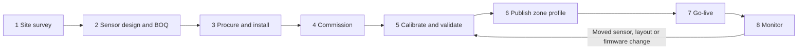
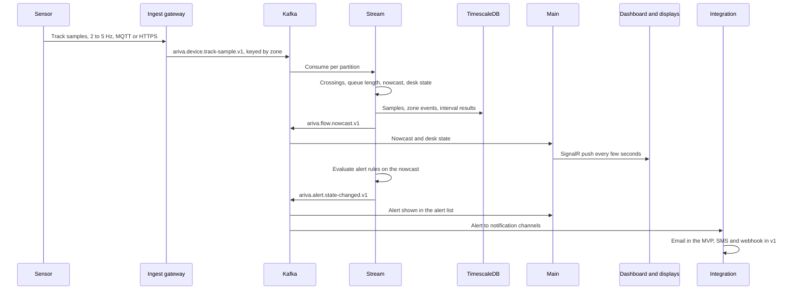
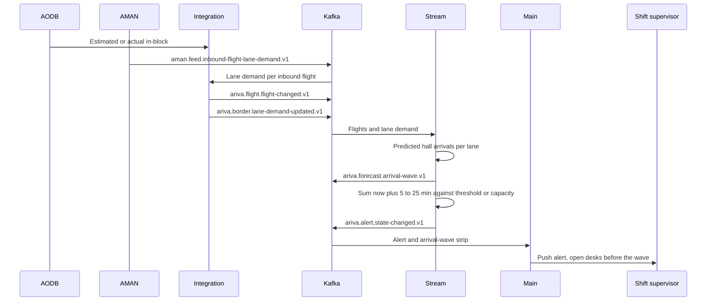
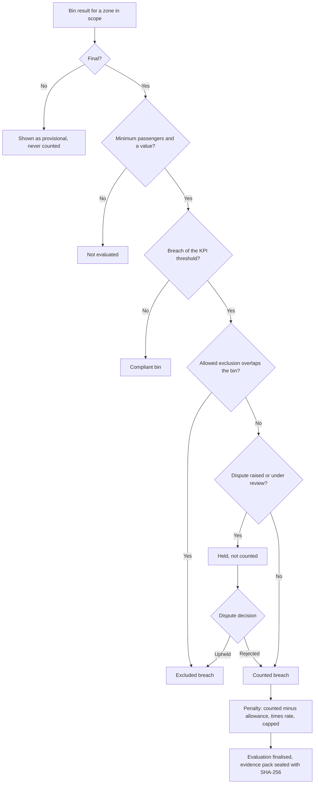
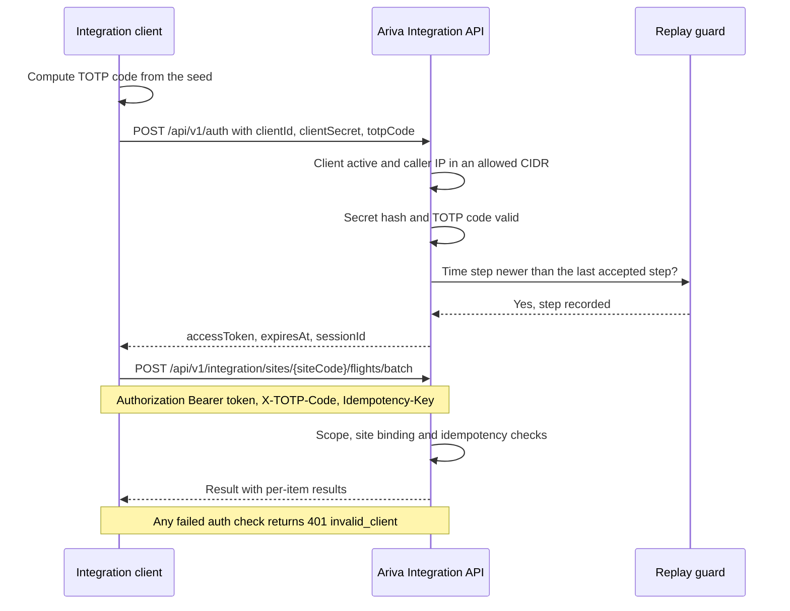

# Business flow

This page follows Ariva end to end: how a site goes from survey to live service, how a sensor reading becomes a number on a screen, how an arrival wave turns into a staffing alert, how handler penalties are evaluated (v1), and how an external system authenticates. Each flow has a diagram and a step table saying who does what.

## A. Site lifecycle: from survey to go-live

| # | Step | Who | What happens | Output | Duration (assumption from the roadmap) |
|---|---|---|---|---|---|
| 1 | Site survey | Local integration partner with the Dalil field engineer | Measure ceilings and halls, photograph snake layouts, record obstructions, network rooms, power, time sources and access constraints | Survey report, photographs, floor plan | 1 to 3 weeks |
| 2 | Sensor design and BOQ | Dalil architect and field engineer | Choose the device family per ceiling height, plan coverage and overlap (F1 to F3), size servers and network, write the bill of quantities | Sensor layout, BOQ, network design | Part of the proposal |
| 3 | Procure and install | Procurement, local partner | Order sensors (lead time and customs), mount, cable, power over Ethernet, label, signage | As-built documentation, device list | 4 to 10 weeks order and delivery, 1 to 3 weeks installation |
| 4 | Commission | Dalil field engineer, site administrator | Register devices, issue credentials, configure output to the gateway, check time sync, calibrate the floor plan, draw zones and lines as a draft profile | Devices in `Commissioning`, draft zone profile | Calibration and commissioning 1 to 2 weeks |
| 5 | Calibrate and validate | Field engineer, client staff | Per device: counting accuracy against a manual count sample. Per site: validation campaign with manual counts, timed tracers and observer logs over at least five operating days including two peaks | Calibration records, validation report | 2 to 3 weeks |
| 6 | Publish zone profile | Site administrator (step-up MFA) | Publish the validated profile as an immutable version and activate it | Active zone profile version | Hours |
| 7 | Go-live | Client operations, Dalil | Devices `Online`, alert rules enabled, displays switched on, burn-in | Live service | Two weeks of burn-in in the pilot scenario |
| 8 | Monitor | Client operations, Dalil support, local partner | Watch data quality, device health and feeds; re-calibrate on triggers | Health and incident records | Continuous |

Notes:

- Zones are drafted during commissioning; validation runs on that draft profile version; the validated version is the one activated for production and, in v1, signed into handler contracts. Any later change is a new version, never an edit.
- A device moves to `Online` only after a passed calibration (counting accuracy of at least 95 percent by default). See [Commissioning and calibration](07-Commissioning-and-Calibration.md).
- The calendar is set by hardware, the client's change control for AMAN changes and validation fieldwork, not by software. These chains run in parallel after the contract and meet at commissioning.

## B. Live operations loop

| # | Step | Component | Detail |
|---|---|---|---|
| 1 | Sense | Sensor | Each sensor tracks people in its footprint and timestamps samples with its own synchronised clock (NTP or PTP). Health (frame rate, temperature, clock offset) every 10 to 30 seconds |
| 2 | Ingest | Ariva.Api.Ingest (device gateway, one per terminal on the sensor VLAN) | Authenticates the device, validates and size-limits the payload, maps the vendor dialect to canonical events, checks the clock offset, buffers to disk if Kafka is unreachable |
| 3 | Publish | Kafka | `ariva.device.track-sample.v1` and `ariva.device.health.v1`, keyed by the owning queue zone id so a whole process stays on one partition |
| 4 | Compute | Ariva.Api.Stream | Applies the active zone profile: line crossings (F4), occupancy and queue length, realised waits by entry bin (F5, F6), nowcast (F8), desk state (F10), overflow, data-quality flags (F11). Bins close on a watermark; late events reopen a bin as a new revision |
| 5 | Store | PostgreSQL with TimescaleDB | Raw samples and zone events by binary COPY (kept for the dispute window, 90 days by default); interval results upserted by (zone, bin start, revision) |
| 6 | Push | Ariva.Api.Main | Consumes compacted nowcast and desk-state topics and pushes them over SignalR to dashboards, filtered by the user's tenant and data scope; serves the read-only display endpoint |
| 7 | Display | Ariva.Web | Dashboards show nowcast and realised waits with their flags; passenger boards show the nowcast in 5-minute bands with hysteresis, never a realised number, and a neutral message when data is stale |
| 8 | Alert | Stream (rules), Main (list), Cronz (escalation timers), Integration (channels) | Rules evaluate nowcasts and forecasts, never realised waits. One open alert per rule and target; escalation if not acknowledged in time |

Who acts: nobody in the loop; it runs continuously. Supervisors act on what it shows (open desks, acknowledge alerts). If a sensor drops out, its zone turns `Degraded` and screens show a band instead of a number; if an entry or exit line loses coverage, the wait becomes `Unknown` and screens show a neutral message.

## C. Arrival wave: from on-block to staffing alert

Border module. In the MVP only if an AODB feed is already available; standard from v1.

| # | Step | Who or what | Detail |
|---|---|---|---|
| 1 | Flight times | AODB through Ariva.Api.Integration | Estimated in-block before landing, actual in-block after. Messages are applied by their own timestamps; identity changes (diversions, renumbering, codeshares) go through the canonical flight id map |
| 2 | Lane demand | AMAN (border deployments) | `InboundFlightLaneDemand`: boarded total, passengers per manual lane (CIT, RES, VIS, CRW) and e-gate eligible, computed by AMAN from API data. Without AMAN, Ariva uses a configured lane mix (reference: CIT 0.35, RES 0.20, VIS 0.35, CRW 0.02, transfers 0.08, e-gate share 0.40 of citizens and residents) |
| 3 | Hall arrival curve | Ariva.Api.Stream | Passengers reach the hall 8 to 15 minutes after on-block (reference midpoint 11 minutes when unknown), spread over about 12 minutes with fixed reference weights (F14). E-gate rejects (reference rate 0.07) are added to the receiving manual lane (F12) |
| 4 | Wave alert | Alert rules in Stream | The sum of predicted arrivals over the window now plus 5 to now plus 25 minutes, per hall or lane, compared with a threshold or with the capacity of staffed desks over the same window (threshold To confirm) |
| 5 | Act | Border shift supervisor | Sees the alert and the wave strip (flights landing in the next 30 minutes, passengers by lane, predicted hall arrival curve) and opens desks before the wave reaches the hall |

If the AODB feed is stale, the wave alert uses the last estimates and says so, and forecasts are marked as built on stale inputs. If AMAN lane demand is missing, the configured lane mix is used and the result is flagged. A sensor surge at immigration with no matching on-block raises a data-quality alert; the wave is still visible in live measurement.

The reference scenario shows this at 18:05: a visitor-heavy arrival wave pushes the arrivals Visitors nowcast above 15 minutes and rule R-001 fires.

## D. SLA and penalties for handlers (planned for v1)

Airport Operations module; which module licenses the engine is To confirm. Exact rules are in [KPI and SLA definitions](15-KPI-and-SLA-Definitions.md) and F17.

| # | Step | Who | Detail |
|---|---|---|---|
| 1 | Contract | Terminal duty manager drafts and signs (step-up MFA) | Party (the handler), scope (its islands), KPI (P90 wait per bin, share under threshold, or overflow minutes), threshold, bin size, evaluation window, minimum passengers per bin, allowed exclusion types, monthly allowance, rate per breached bin, monthly cap, dispute window, signed zone profile version, effective date. Signed terms are immutable; a change is a new contract version |
| 2 | Bins | Ariva.Api.Stream | Realised waits attributed to the entry bin. A bin is provisional while anyone who entered in it is unresolved or the watermark has not passed; then final. Only final bins are evaluated |
| 3 | Exclusions | Terminal duty manager adds them; sensor outages are detected | Types from the prototype (per contract, To confirm): security directive, sensor outage over the zone for more than 5 minutes in the bin, counters closed on airport instruction, flight disruption outside the handler's control, upheld dispute |
| 4 | Evaluation | Ariva.Api.Cronz (TickerQ job) | Per window: breaches, minus excluded, minus held; allowance; penalty capped. Provisional breaches are shown but never counted |
| 5 | Dispute | Handler station manager raises; terminal duty manager decides | Within the dispute window (reference: 5 working days), on final breached bins only. Raised and Under review hold the bin; Upheld excludes it; Rejected counts it. A resolution recomputes the evaluation as a new revision |
| 6 | Recompute | Recomputation tooling (v1); who may run it is To confirm | A disputed period can be recomputed from raw samples under a named zone profile version; the result is a new revision and the original is kept |
| 7 | Evidence pack | Ariva.Api.Cronz | Interval data, zone profile version, calibration record, exclusions, disputes and quality flags, sealed with a SHA-256 content hash and recorded with the evaluation |

Reference contract values from the prototype (not contractual): P90 per 15-minute bin at most 15 minutes, minimum 1 passenger per bin, allowance 6 breached bins a month, USD 350 per further breached bin, cap USD 10,000 a month, dispute window 5 working days. The reference scenario shows Handler B's check-in island C breaching at 19:10 after a shift change leaves 5 of 12 counters open.

Commercial safeguard from the risk register: offer the penalty tier only after the zones have been validated.

## E. Integration token exchange

How an AODB, an immigration system or a sensor gateway authenticates to the Integration API. The normative specification is `../docs/architecture/integration.md`; the developer view with examples is in [Integration guide](08-Integration-Guide.md).

| # | Step | Who | Detail |
|---|---|---|---|
| 1 | Register | Ariva system administrator (step-up MFA) | Creates an `IntegrationClient`: name, kind (`Aodb`, `Immigration`, `SensorGateway`, `Other`), scopes, bound site codes, allowed source CIDRs, per-request TOTP policy. Ariva shows the client secret and the TOTP provisioning URI once |
| 2 | Load the seed | The integrator's operator | Loads the Base32 seed into any RFC 6238 library (SHA1, 6 digits, 30-second step) |
| 3 | Exchange | Integrator's system | `POST /api/v1/auth` with client id, secret and current code. Checks in order: client active and IP allowed; secret hash; TOTP valid within one step either side; time step newer than the last accepted one; rate limits. Every failure returns the same `401 { "error": "invalid_client" }` |
| 4 | Token | Ariva | JWT with audience `ariva-integration`, lifetime 15 minutes, claims `sub`, `sid`, `scope`, `site`. No refresh token: re-authenticate with a fresh code |
| 5 | Call | Integrator's system | `Authorization: Bearer`, `X-TOTP-Code` on every call when the client's per-request policy is on (default for immigration clients), `Idempotency-Key` on every write |
| 6 | Audit | Ariva | Every call is audited: client, scope, endpoint, site, result, payload SHA-256 |

Lockout: 5 attempts per minute per client and 20 per minute per IP; 10 consecutive failures lock the client for 15 minutes and alert the administrators.
