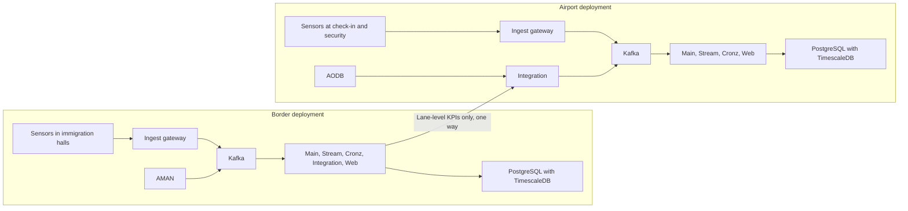

# Deployment guide

How to install Ariva on a customer's on-premises Kubernetes cluster, following AMAN's deployment conventions (Helm chart per platform, Helmfile, appsettings mounted from Kubernetes secrets, Azure DevOps release pipelines). It also covers bootstrap, smoke tests, upgrades, backup and local development.

Status: the chart, Helmfile, pipelines and appsettings exist; the hosts serve health probes only. Steps that depend on code not yet written are marked "Target procedure" with the epic that delivers them (see [Home](Home.md) for epic names).

## 1. Deployment topologies

| Topology | Where | Modules | What crosses the boundary |
|---|---|---|---|
| Border deployment | Own namespace and database, in AMAN's cluster or a separate one | Core plus Border | In: AMAN aggregate events. Out: lane-level wait times and KPIs only |
| Airport deployment | The airport operator's environment, on premises or their private cloud | Core plus Airport Operations | In: AODB, signage acknowledgements, the border feed where one exists |
| Combined site | Two deployments | Both | One-way aggregate feed, border to airport |
| Small site | Single node, single Kafka broker, single database | Core plus one module | Same rules; reduced availability, accepted in writing |


Rules: every deployment is in-country; the airport side never gets a route into the border network; real-time measurement never depends on a WAN. A border deployment may reuse AMAN's Kafka cluster only with the dedicated `ariva.` topic prefix and ACLs.

## 2. Prerequisites

| Item | Requirement | Notes |
|---|---|---|
| Kubernetes | A supported release; the chart uses `apps/v1`, `autoscaling/v2` (Kubernetes 1.23 or later) and `networking.k8s.io/v1` Ingress | Exact minimum version: To confirm against AMAN's cluster baseline |
| Nodes | Linux x64 (images are published for `linux-x64`). One node for a small site, three for a standard site | Node size: see sizing below |
| Metrics server | Required: every Deployment has a HorizontalPodAutoscaler on CPU (60 percent) and memory (70 percent) | Without resource metrics the HPAs cannot scale |
| Ingress controller | ingress-nginx, class `nginx`, with ModSecurity enabled and snippet annotations allowed | The chart's Ingress uses `server-snippet` (returns 421 for a wrong host) and `modsecurity-snippet` (blocks dangerous uploads). Recent ingress-nginx releases disable snippet annotations by default; the cluster owner must allow them or these protections do not apply. The Kubernetes project announced the retirement of ingress-nginx in November 2025; a move to another controller or the Gateway API is To confirm |
| Storage class | A class for ReadWriteOnce volumes (TimescaleDB, Kafka, and the Ingest disk buffer once added) | The TimescaleDB values use the cluster default class. AMAN's Helmfile carries Longhorn and Rook-Ceph releases for this |
| DNS | One record per ingress host, `<subdomain>.<domain>` | Production subdomains in `values-k8s-prd.yaml`: `ariva`, `api-main-ariva`, `api-ingest-ariva`, `api-cronz-ariva`, `api-integration-ariva`. Replace `dalilhub.tech` with the customer's domain |
| TLS certificates | A certificate covering every ingress host, from the customer's PKI or a public CA | The chart's Ingress objects have no `tls` section today. Either the controller serves a default certificate (for example a wildcard for the site domain, To confirm against AMAN's practice) or a `tls` block is added per site (Target procedure, implemented in Phase 0 epic Skeleton and platform) |
| Image registry | Pull access to `dalil.azurecr.io/ariva`, or an internal mirror such as Harbor at air-gapped sites | Pull secret `dalilacr-secret` is rendered from `imageCredentials` when a password is passed |
| Tools | kubectl, Helm 3.19.0, Helmfile 1.1.7, helm-diff plugin v3.13.0 | The versions the release pipeline installs |
| Time | NTP on every node | See [Network and ports](05-Network-and-Ports.md) |
| PostgreSQL | PostgreSQL 16 or later (17 recommended) with TimescaleDB Community Edition | See dependencies below |
| Kafka | KRaft mode | Dedicated or AMAN's |
| Redis | Any supported version (To confirm) | Dedicated or AMAN's |
| Observability | An OTLP endpoint (SigNoz) or Loki | Set `otel.endpoint` |
| Identity | Bundled Keycloak or the customer's OIDC provider (Phase 1) | Which one per site: To confirm |
| Mail relay | SMTP relay reachable from Integration | For alert email (MVP) |
| Licence | Signed, offline-verifiable licence file per deployment | Basic in the MVP, complete in v1. Loading mechanism: To confirm |

## 3. Sizing

Figures for the large profile are D5's sizing assumption. The small and medium rows are Estimates, scaled linearly from the same assumptions: 30 people per sensor, 5 Hz, about 100 bytes per sample on the wire, samples stored at 1 Hz for a third of the people tracked at peak, 90-day dispute window. Replace them with measured rates after the pilot.

| Profile | Example | Sensors | People tracked at peak | Ingest messages per second | Ingest bandwidth | Stored sample rows per second | Compressed samples for 90 days | Database volume to provision | Nodes | Kafka brokers |
|---|---|---|---|---|---|---|---|---|---|---|
| Small (Estimate) | One arrivals hall, pilot scale (reference hall of 1,080 m2 needs about 15 sensors) | 15 | 450 | 2,250 | 0.23 MB/s | 150 | 12 to 24 GB | 30 GB | 1 | 1 |
| Medium (Estimate) | 8 million passengers a year, the BOQ reference airport (59 sensors) | 59 | 1,770 | 8,850 | 0.9 MB/s | 590 | 47 to 94 GB | 120 GB | 3 | 3 |
| Large (D5) | Busy terminal | 100 | 3,000 | 15,000 | 1.5 MB/s | 1,000 | 80 to 160 GB | 200 GB | 3 | 3 |

Add to the database volume: interval results, forecasts and configuration (kept indefinitely; small next to raw samples), WAL, and local backup space if backups are written to the same storage. A longer dispute window scales the sample storage linearly.

Application pods (from the chart defaults and `values-k8s-prd.yaml`: HPA minimum 2 for Main, Ingest, Stream and Web, 1 for Cronz and Integration, Simulation off):

| Host | Request per pod | Limit per pod | Replicas in production values |
|---|---|---|---|
| api-main | 250m CPU, 750Mi | 1000m, 1000Mi | 2 to 4 |
| api-ingest | 250m, 512Mi | 1000m, 1000Mi | 2 to 4 |
| api-stream | 500m, 750Mi | 2000m, 1500Mi | 2 to 4 |
| api-cronz | 100m, 512Mi | 1000m, 1000Mi | 1 |
| api-integration | 100m, 512Mi | 500m, 750Mi | 1 |
| web | 50m, 64Mi | 250m, 128Mi | 2 to 3 |
| simulation | 100m, 256Mi | 500m, 512Mi | Not deployed in production |

Totals at the HPA minimums: about 2.3 CPU cores and 5 GiB of memory requested. At the HPA maximums the limits add up to about 18 cores and 16 GiB. Add TimescaleDB (the intended values are 500m and 2Gi requested, 2 cores and 4Gi limit), Kafka, Redis, the ingress controller and monitoring. Node size per profile: To confirm after the Phase 1 load test at 15,000 messages per second.

## 4. Dependencies

### PostgreSQL with TimescaleDB

- PostgreSQL 17 with TimescaleDB Community Edition (Tiger Data licence): free to run on self-managed infrastructure, including production inside a product Dalil deploys for a customer; it may not be offered to third parties as a database service, which Ariva never does.
- The extension must exist on every restore target and in the HA image. The intended image is `timescale/timescaledb-ha` with a pinned pg17 tag.
- Options per site:
  1. The Ariva TimescaleDB chart (`Charts/timescaledb`). Today it is a placeholder marked `installed: false` in `helmfile-k8s.yaml.gotmpl` (its StatefulSet, Service and PVC templates are a Target procedure, implemented in Phase 0 epic Skeleton and platform. The base settings expect a Service named `timescaledb` on port 5432.
  2. A PostgreSQL operator or Patroni with streaming replication for HA, using an image that includes TimescaleDB. The operator should match what AMAN runs (To confirm).
  3. A customer-managed PostgreSQL 16 or later with TimescaleDB, set through `Database:Host`.
- Set `timescaledb.telemetry_level` to `off` (the intended chart value).

### Kafka

- KRaft mode. Standard site: three brokers, replication factor 3, `min.insync.replicas` 2, producers with `acks=all`. Small site: one broker.
- D5 recommends the Strimzi operator (KRaft only from 0.46); AMAN's Helmfile deploys Kafka with the kubelauncher chart 0.1.19. If the cluster is shared, align with AMAN's chart (To confirm).
- Ariva does not ship its own Kafka release. Either reuse AMAN's release in the same cluster (topics prefixed `ariva.`, prefix ACLs), or copy AMAN's Kafka chart values into `./Charts` and add a release to the Helmfile.
- The base settings use `kafka:9092`. If Kafka runs in another namespace, use the full service name, for example `kafka.<aman-namespace>.svc.cluster.local:9092`.

### Redis

- Holds the FusionCache second level, the SignalR backplane and idempotency keys. Not a system of record. Required for more than one Main replica.
- Reuse AMAN's Redis (keys use the instance name `ariva:`) or deploy a dedicated release from AMAN's Redis chart values. The base settings use `redis:6379`.

## 5. Configuration layering

Each .NET host loads, in this order (later wins):

1. `appsettings.base.json` (linked from Ariva.Api.Common)
2. `appsettings.base.<env>.json`
3. `appsettings.service.json` (the host's own)
4. `appsettings.service.<env>.json`
5. Environment variables (for example `Database__Password`), then command-line arguments

The environment comes from `DOTNET_ENVIRONMENT` (set by each host's ConfigMap from the `environment` value), or from `environment.json` when the variable is not set. Environments: `vm-local`, `k8s-dev`, `k8s-demo`, `k8s-prd`.

In Kubernetes the two environment files are not taken from the image. The release writes them into secrets, and the chart mounts them over the image's copies:

| Secret | Key | Mounted at |
|---|---|---|
| `base-appsettings-secret` | `appsettings.base.<env>.json` | `/app/appsettings.base.<env>.json` in every .NET host |
| `<service>-appsettings-secret` (`api-main`, `api-ingest`, `api-stream`, `api-cronz`, `api-integration`, `simulation`) | `appsettings.service.<env>.json` | `/app/appsettings.service.<env>.json` in that host |
| `ariva-dataprotection` (type `kubernetes.io/tls`; name set by `dataProtectionSecretName`) | `tls.crt`, `tls.key` | `/app/secrets/dataprotection/` in every API host, read-only. Encrypts the shared Data Protection key ring at rest (ARV-008); an API pod does not start without it |

Real credentials never live in the repository: the committed `k8s-*` files carry empty passwords.

The database connection string is not configured as text: the hosts build it from `Database:Host`, `Port`, `Name`, `Username` and `Password` with Npgsql's builder, so a password containing `;` cannot add options. Placeholders: values such as `"${Database:Host}"` reference other keys. AMAN resolves them with ConfigurationSubstitutor (the package is already in `Directory.Packages.props`). Ariva's hosts currently layer the files with framework APIs only; the substitution step arrives with the port of AMAN's configuration extension (Target procedure, implemented in Phase 0 epic Skeleton and platform). Until then, do not rely on placeholders resolving.

Main settings:

| Key | Repository default | Production guidance |
|---|---|---|
| `Application:Environment`, `Domain`, `BindingHost`, `BindingPort` | `k8s-prd`, `dalilhub.tech`, `0.0.0.0`, 8080 | Set `Domain` to the customer's domain |
| `Application:IsHighAvailable` | `true` in `k8s-prd` | Keep |
| `Database:Host`, `Port`, `Name` | `timescaledb`, 5432, `ariva` | Point at the site's PostgreSQL |
| `Database:Username`, `Password` | `ariva_app`, empty | The runtime login every host uses (DML only). The migration job creates it and sets this password; secret only |
| `Database:Migration:Username`, `Password` | `ariva`, empty | The migration login (owner, DDL), used only by the migration job; secret only |
| `Database:UseEncryption` | `false` | `true` in production: TLS with full certificate and host name verification (`SslMode=VerifyFull`); the server certificate must chain to a CA the image trusts |
| `Database:VerifySchemaOnStartup` | `true` (`false` in vm-local) | Keep: a host stops at startup when a shipped script is missing or an applied one changed |
| `Database:AllowSchemaUpdate` | `false` (`true` in vm-local) | Never `true` outside a developer machine; a unit test enforces it |
| `Redis:Enabled`, `ConnectionString`, `InstanceName` | `true` in clusters, `redis:6379`, `ariva:` | StackExchange.Redis format, for example `redis:6379,password=...` (secret only). FusionCache uses it as the shared level and the backplane |
| `DataProtection:CertificatePath`, `KeyPath` | `/app/secrets/dataprotection/tls.crt`, `tls.key` | Keep; the chart mounts the `ariva-dataprotection` secret there |
| `Kafka:BootstrapServers`, `TopicPrefix` | `kafka:9092`, `ariva` | Keep the prefix `ariva` |
| `Kafka:GroupId` | `ariva-stream` (Stream), `ariva-integration` (Integration) | Keep; operators use these names for lag checks |
| `Redis:ConnectionString`, `InstanceName` | `redis:6379`, `ariva:` | Point at the site's Redis |
| `Timescale:Enabled`, `Crons:Enabled` | `true` | Keep |
| `Cache:DefaultDurationSeconds`, `UseDistributedCache` | 300, `true` | Keep |
| `Microservices:<Host>:External`, `Internal` | Ingress URL, `http://<service>` | Set External URLs to the site's hosts |
| `Email:*` (Integration) | Disabled, `127.0.0.1:1025` | Set the site's SMTP relay, sender address and TLS |
| `Simulation:Seed`, `SiteCode` | 9303, `DMO` | Simulation is disabled in production |

Main Helm values (`Charts/platform/values*.yaml`):

| Value | Meaning |
|---|---|
| `environment` | Selects the appsettings environment files and `DOTNET_ENVIRONMENT` |
| `imageRepository`, `buildNumber`, `imagePullPolicy` | Image is `<imageRepository>/<service>:<buildNumber>`. Production uses `IfNotPresent`; pin `buildNumber` to a build number, never a branch tag |
| `releaseVersion` | Written to `RELEASE_VERSION`, labels and telemetry; the release pipeline sets it to the build number |
| `domain`, `clusterName` | Ingress host suffix; cluster identity in telemetry |
| `replicas`, `<service>Replicas`, `<service>HpaMin`, `<service>HpaMax` | Replica counts (AMAN key style) |
| `<service>CpuRequest`, `MemRequest`, `CpuLimit`, `MemLimit` | Resource overrides per service |
| `simulationEnabled` | Deploys the simulation host; `false` in production |
| `otel.endpoint`, `otel.protocol` | OTLP export target (`grpc` by default) |
| `imageCredentials.registry`, `username`, `password` | Rendered into `dalilacr-secret` when a password is given |
| `ingresses` | List of `{ name, comment, subdomain, serviceName, annotations }` |

The web image reads the API base URLs at build time from `VITE_ARIVA_*` variables (`src/lib/core/Endpoints.ts`), falling back to localhost. The current image build passes none, so each site needs a web build with its URLs, or runtime configuration (To confirm; Target procedure, implemented in Phase 0 epic Minimal dashboard).

## 6. Install

The `k8s-dev` release pipeline (`Platform/Cloud/Ariva.Cicd/AzureDevOps/K8s/Release-ariva-k8s-dev.yaml`) is the reference procedure. A manual install on a customer cluster follows the same steps.

### 6.1 Prepare

1. Agree the namespace. The dev pipeline uses `ariva-k8s-dev`; for a site, use one namespace per deployment (border and airport separately).
2. Prepare the site overrides under `deploy/<site>/` in the repository: a values file with the customer's domain, subdomains, `clusterName`, `imageRepository` (mirror if air-gapped), `buildNumber` and `otel.endpoint`. Keep the appsettings JSON with credentials out of git.
3. Write the environment files: `appsettings.base.<env>.json` and one `appsettings.service.<env>.json` per host, starting from the committed `k8s-prd` files and adding the real hosts and passwords.
4. Check DNS, TLS, the storage class and that PostgreSQL, Kafka and Redis are reachable from the namespace.

### 6.2 Create the namespace and the appsettings secrets

```bash
export NAMESPACE=<namespace>
export ENVIRONMENT=k8s-prd

kubectl create namespace "$NAMESPACE" --dry-run=client -o yaml | kubectl apply -f -

kubectl create secret generic base-appsettings-secret \
  --from-file=appsettings.base.$ENVIRONMENT.json=./appsettings.base.$ENVIRONMENT.json \
  --namespace="$NAMESPACE" --dry-run=client -o yaml | kubectl apply -f -

for svc in api-main api-ingest api-stream api-cronz api-integration; do
  kubectl create secret generic ${svc}-appsettings-secret \
    --from-file=appsettings.service.$ENVIRONMENT.json=./${svc}/appsettings.service.$ENVIRONMENT.json \
    --namespace="$NAMESPACE" --dry-run=client -o yaml | kubectl apply -f -
done
```

Add `simulation` to the loop only where `simulationEnabled` is true (dev and demo).

The Data Protection certificate (RSA 3072 or larger, key usage key encipherment) is created once per deployment and kept in the site's secret store; it is not a TLS server certificate and needs no public CA:

```bash
openssl req -x509 -newkey rsa:3072 -sha256 -days 1825 -nodes \
  -subj "/CN=Ariva Data Protection ($NAMESPACE)" -keyout dp.key -out dp.crt
kubectl create secret tls ariva-dataprotection --cert=dp.crt --key=dp.key \
  --namespace="$NAMESPACE" --dry-run=client -o yaml | kubectl apply -f -
```

Rotation: create the new pair, add the old one under `DataProtection:Previous:0:CertificatePath` and `KeyPath` (mount it from a second secret), then replace `ariva-dataprotection`. New keys are encrypted with the new certificate; existing keys stay readable until they expire (90 days), after which the previous entry can go. Losing the certificate makes every protected value unreadable (refresh cookies, encrypted TOTP seeds); back it up with the database.

### 6.3 Deploy the platform

Every environment uses the Helmfile, selecting its values file with `-e` (`dev`, `demo`, `prd`, `localk8s`):

```bash
helmfile apply \
  -f Platform/Cloud/Ariva.K8s/Helm/helmfile-k8s.yaml.gotmpl \
  -e prd \
  --state-values-set buildNumber=<build number> \
  --namespace "$NAMESPACE" \
  --kube-context <context> \
  --set releaseVersion=<build number> \
  --set imageCredentials.username=<registry user> \
  --set imageCredentials.password=<registry password>
```

The chart refuses to render production without an explicit `buildNumber` (never `trunk`, never empty) and refuses the `latest` tag everywhere. Every ingress needs a TLS certificate secret (`tlsSecretName`, default `ariva-tls`) in the namespace before the release. Customer sites can still layer a site file with Helm directly, using the same release name:

```bash
helm upgrade --install ariva-platform Platform/Cloud/Ariva.K8s/Helm/Charts/platform \
  --namespace "$NAMESPACE" --kube-context <context> \
  -f Platform/Cloud/Ariva.K8s/Helm/Charts/platform/values-k8s-prd.yaml \
  -f deploy/<site>/values-<site>.yaml \
  --set releaseVersion=<version> \
  --set buildNumber=<build number> \
  --set imageCredentials.username=<registry user> \
  --set imageCredentials.password=<registry password>
```

Then wait for the rollouts:

```bash
for d in api-main api-ingest api-stream api-cronz api-integration web; do
  kubectl -n "$NAMESPACE" rollout status deployment/${d}-deployment --timeout=300s
done
```

Startup probes allow up to about two minutes per .NET pod (10 seconds initial delay, 8 failures at 15-second intervals).

### 6.4 Things to know about the chart

- Every Deployment carries a `rollme` annotation with a random value (AMAN pattern), so every apply restarts every pod. Plan applies inside a maintenance window.
- The Ingest host is exposed through the shared ingress like the other APIs. The design places one Ingest instance per terminal on the sensor VLAN with a disk-backed buffer; the placement (node affinity or a separate gateway node), the persistent volume for the buffer, and keeping the Ingest ingress off the user network are Target procedures, implemented in Phase 0 epic Device gateway and simulator.
- The Cronz ingress exposes the TickerQ dashboard; restrict it to the administration network.
- Pods run as a non-root user (set in each Dockerfile); the chart does not yet set a `securityContext` with `runAsNonRoot` (Target procedure, implemented in Phase 1 epic Hardening).
- Cronz runs one replica in every values file; keep it at one unless TickerQ's multi-instance behaviour is confirmed (To confirm).

## 7. First-time bootstrap

### 7.1 Database

1. Create the database `ariva`, owned by the migration login (`ariva` by default), and enable the extension: `CREATE EXTENSION IF NOT EXISTS timescaledb;`
2. Put both logins in `appsettings.base.<env>.json` in `base-appsettings-secret`: `Database:Migration:Username`/`Password` (owner) and `Database:Username`/`Password` (runtime, at least 16 characters; the login does not need to exist yet).
3. Deploy. The Helm hook Job `database-migration` runs the api-main image with `--migrate` (after the first install, before every upgrade). It applies `Ariva.Infra/Timescale/Scripts/NNNN_*.sql` in numeric order, each in a transaction with its `schema_version` row (name, SHA-256, time, login), under a PostgreSQL advisory lock. `0001_roles.sql` creates `ariva_migration` (DDL) and `ariva_runtime` (DML only); the job then creates or updates the runtime login as a member of `ariva_runtime`.
4. The hosts connect as the runtime login and check `schema_version` at startup: a missing script or a changed checksum stops the pod (`SchemaBehindException` or `SchemaDriftException` in the log). Scripts are never edited once shipped; `checksums.lock` makes such an edit fail the build.
5. Check: `SELECT script_name, applied_on, applied_by FROM schema_version ORDER BY 1;` lists every script; `\dx` shows `timescaledb`; `\du ariva_app` shows membership of `ariva_runtime` only.

Run the migration by hand (for example before a maintenance window) with the same image: `dotnet Ariva.Api.Main.dll --migrate` or `./Ariva.Api.Main --migrate`; exit code 0 means every script is applied.

Hypertable scripts revoke UPDATE and DELETE on raw sample tables from `ariva_runtime` (only the retention job removes data). NHibernate `SchemaUpdate` is never used outside development.

### 7.2 Kafka topics

Target procedure, implemented in Phase 0 epic Skeleton and platform.

Topics come only from the fixed list in code (`KafkaTopics` constants); the provisioning step and its tests (`TopicProvisioningTests`) are part of the platform epic. Where Ariva may not create topics (a shared AMAN cluster), the cluster owner creates them with the same names and settings, and grants prefix ACLs on `ariva.` per service. Example for a standard site:

```bash
kafka-topics.sh --bootstrap-server <broker:port> --create \
  --topic ariva.device.track-sample.v1 --partitions <n> --replication-factor 3 \
  --config min.insync.replicas=2 --config retention.ms=259200000 --config max.message.bytes=1048576

kafka-topics.sh --bootstrap-server <broker:port> --create \
  --topic ariva.flow.nowcast.v1 --partitions <n> --replication-factor 3 \
  --config min.insync.replicas=2 --config cleanup.policy=compact --config max.message.bytes=1048576
```

| Retention class | Proposed default | `retention.ms` |
|---|---|---|
| Short | 3 days | 259200000 |
| Medium | 14 days | 1209600000 |
| Long | 30 days | 2592000000 |
| Compacted | | `cleanup.policy=compact` |

Partition counts are To confirm; zone-keyed topics need at least as many partitions as the maximum number of Stream replicas (4 in the production values). At a small site use replication factor 1 and `min.insync.replicas=1`. The `aman.feed.*` topics are created and configured by AMAN; Ariva's Integration host needs read access only.

### 7.3 First administrator

Target procedure, implemented in Phase 1 epic Authentication, roles and audit.

1. A one-time bootstrap creates the first System administrator (mechanism To confirm; it must not leave a standing default password).
2. At first sign-in the administrator must enrol TOTP before any other action. Administrators always use MFA, and critical functions require a TOTP check within the last 15 minutes.
3. The administrator creates a second System administrator: granting that role needs step-up MFA and a second administrator.
4. The bootstrap credential is disabled. Every step is written to the audit log.
5. Load the licence file, create the site (site code, languages), and register the identity provider if the customer's OIDC is used.

## 8. Smoke tests

| # | Check | Command or action | Expected |
|---|---|---|---|
| 1 | Pods ready | `kubectl -n "$NAMESPACE" get pods` | All `Running` and ready |
| 2 | Probes inside the cluster | `kubectl -n "$NAMESPACE" port-forward svc/api-main-service 8080:80`, then `curl -fsS http://localhost:8080/health/readiness` | `{"status":"Healthy","probe":"readiness"}`; repeat for each API service |
| 3 | Web through the ingress | `curl -fsS https://<web host>/healthz` | `ok` |
| 4 | APIs through the ingress | `curl -fsS https://<api-main host>/health/liveness` | Healthy JSON |
| 5 | Dependencies | Readiness will include PostgreSQL, Kafka and Redis checks (Target procedure, implemented in Phase 0 epic Skeleton and platform) | Today readiness only proves the process is up |
| 6 | End-to-end suite | `node scripts/verify.mjs e2e` against the environment (Target procedure, implemented in Phase 0 epic Integration API and mocks: `Platform/Testing/Ariva.E2E` is not yet in the repository; how to point it at a deployed environment is To confirm) | All tests pass |
| 7 | Reference scenario (dev and demo) | Run the simulator's reference day | Alert at 18:05, degraded zone 18:20 to 18:30, SLA breach at 19:10 (once the engine exists) |

## 9. Upgrades and rollbacks

Before an upgrade:

1. Read the release notes ([Release notes and versioning](18-Release-Notes-and-Versioning.md)), especially database scripts and contract changes.
2. Confirm a recent backup (section 10).
3. Preview: `helmfile diff` or `helm diff upgrade ...` (the helm-diff plugin is installed by the pipeline).
4. Agree the window: every apply restarts all pods.

Upgrade: the build pipelines tag every image with the branch name and the build number. Re-run the install step with the new `buildNumber` and `releaseVersion`, and update the appsettings secrets first if the release notes say so.

Rollback:

```bash
helm history ariva-platform -n "$NAMESPACE"
helm rollback ariva-platform <revision> -n "$NAMESPACE"
```

- Rollback restores manifests. If the release used a mutable tag such as `trunk`, the image does not roll back; this is why production pins `buildNumber`.
- The appsettings secrets are created outside Helm, so a rollback does not restore them. Keep the previous files.
- Database scripts are forward-only. A release whose scripts are not backward compatible cannot be rolled back by Helm alone; restore the database instead. Proposed rule: schema changes are additive in one release and destructive only in a later one.
- AMAN feed contracts change additively within V1, so an Ariva rollback does not break AMAN.

## 10. Backup and restore

The method depends on how PostgreSQL is run (operator or Patroni, to match AMAN; To confirm). The commands below are a Target procedure, implemented in Phase 1 epic Hardening.

What to back up:

| Item | Back up? | Why |
|---|---|---|
| PostgreSQL database `ariva` (relational tables and hypertables) | Yes | System of record: configuration, contracts, alerts, audit, interval results (indefinite) and raw samples for the dispute window |
| Data Protection key ring | Yes, separately and encrypted | Integration client TOTP seeds and outbound endpoint secrets are encrypted with it; without it they cannot be decrypted. Where it is persisted: To confirm |
| Token signing keys (users, integration clients, devices) | Yes, separately and encrypted | Separate keys per principal type |
| Appsettings secrets, TLS certificates, licence file | Yes, in the customer's secret store | Needed to rebuild the deployment |
| Site overrides in `deploy/<site>/` | In git | Values without credentials |
| Kafka topics | No | Kafka carries facts with short retention; anything that must be published is kept in the PostgreSQL outbox until relayed; raw samples for recomputation are in TimescaleDB. After a Kafka loss, compacted topics (registry, topology, desk state) are republished from the database (procedure To confirm) |
| Redis | No | Cache, SignalR backplane and idempotency keys; not a system of record. The TOTP replay guard falls back to the database |
| Container images | No, if the registry or offline bundle keeps every released build | Rebuildable from the repository at the release tag |
| Sensor on-board counts | Not by Ariva | Stereo sensors keep counts on board; they are used to backfill interval counts after an outage |

Logical backup with pg_dump (small sites, copies for test):

```bash
pg_dump -Fc -d ariva -f ariva-<date>.dump
```

Restore into a database where the same TimescaleDB version is installed:

```sql
CREATE DATABASE ariva;
\c ariva
CREATE EXTENSION IF NOT EXISTS timescaledb;
SELECT timescaledb_pre_restore();
```

```bash
pg_restore -d ariva ariva-<date>.dump
```

```sql
SELECT timescaledb_post_restore();
```

Physical backup with pgBackRest (standard sites, point-in-time recovery with WAL archiving):

```bash
pgbackrest --stanza=ariva stanza-create
pgbackrest --stanza=ariva --type=full backup
pgbackrest --stanza=ariva --type=diff backup
pgbackrest --stanza=ariva info
```

Restore (PostgreSQL stopped): `pgbackrest --stanza=ariva --delta restore`. Run restores with the owner role, not the runtime role.

Retention of backups: backups contain raw track samples. Keep backup retention no longer than the dispute window plus the backup cycle, so backups do not extend the privacy retention of samples (Proposed). Test a restore at least once before go-live and after every major release.

## 11. Disaster recovery targets

| Target | Value | Status |
|---|---|---|
| Live monitoring availability | 99.5 percent of each month at a standard three-node site | Proposed service target, to agree per contract |
| Committed interval data | No loss | Proposed |
| Recovery from a single node failure | Within 15 minutes | Proposed |
| Pilot availability | 99 percent of operating hours | Proposed pilot acceptance criterion |
| Recovery point objective for loss of the site | To agree with the customer | To confirm |
| Recovery time objective for loss of the site | To agree with the customer | To confirm |
| Secondary site or cold standby | To agree with the customer | To confirm |

When the whole site is down nothing is live; sensors keep on-board counts, which are backfilled; waits for the gap are `Unknown`, and SLA evaluation applies an exclusion rather than a fake value.

## 12. Air-gapped sites

Target procedure, implemented in v1 epic Offline bundle, licensing and HA (basic support in the MVP).

1. Dalil produces an offline bundle per release: the seven images, the chart, the Helmfile and any dependency charts.
2. The images are pushed to the site's registry mirror (for example Harbor, which AMAN's Helmfile can install), and `imageRepository` points at it.
3. The licence file validates offline.
4. No telemetry leaves the site unless the customer opts in: TimescaleDB telemetry off, OpenTelemetry only to the local collector, Dalil support tooling only where the customer allows, health data only.

## 13. Local development

Today:

```bash
dotnet restore Ariva.slnx
dotnet build Ariva.slnx
dotnet test Platform/Backplane/Ariva.UnitTests/Ariva.UnitTests.csproj

cd Platform/Backplane/Ariva.Api.Main
dotnet run                      # listens on http://localhost:51001

cd Platform/Frontplane/Ariva.Web
npm install
npm run dev                     # http://localhost:51010
```

Prerequisites: .NET 10 SDK, Node 22, Docker Desktop or Rancher Desktop.

Local dependencies (TimescaleDB, Kafka in KRaft mode, Redis and smtp4dev) come from `docker-compose.dev.yml`:

```bash
node scripts/dev-up.mjs          # first run creates .env with random passwords; waits for every health check
node scripts/dev-check.mjs       # optional: proves TimescaleDB, the read-only role, Kafka, Redis auth and smtp4dev
node scripts/dev-down.mjs        # stop; add --volumes to delete the data
```

`dev-up` also writes `Platform/Backplane/Ariva.Api.Common/appsettings.local.json` (git-ignored, never in images), which every host loads in `vm-local` after the committed settings, so the hosts reach the containers with the generated credentials. Ports bind to 127.0.0.1 and default away from AMAN's local stack: PostgreSQL 5433, Kafka 19092, Redis 16379, SMTP 2525 and its web UI 5080 (change them in `.env`). The read-only role `ariva_readonly` serves the postgres-dev MCP server: set `ARIVA_DEV_DATABASE_URI` to the URI `dev-up` prints. The `dev-environment` workflow runs the same scripts in CI.

Integration tests start their own containers with Testcontainers (story ARV-007) and need Docker. See [Testing strategy](16-Testing-Strategy.md).
