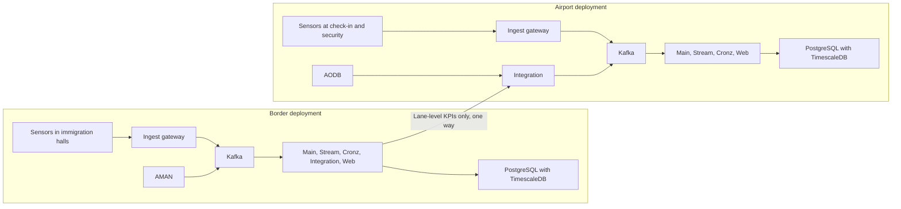

# Deployment guide

How to install Ariva on a customer's on-premises Kubernetes cluster, following AMAN's deployment conventions (Helm chart per platform, Helmfile, appsettings mounted from Kubernetes secrets, Azure DevOps release pipelines). It also covers bootstrap, smoke tests, upgrades, backup and local development.

Status: the platform and TimescaleDB charts, the Helmfile environments, the migration and Kafka topics jobs, the pipelines and the appsettings exist. Every environment is rendered and checked on each change (`Platform/Cloud/Ariva.K8s/tests/chart-security.mjs`), but no release has yet been verified on a cluster: the first release on the dev cluster is a human step (ARV-002). Steps that depend on code not yet written are marked "Target procedure" with the epic that delivers them (see [Home](Home.md) for epic names).

## 1. Deployment topologies

| Topology | Where | Modules | What crosses the boundary |
|---|---|---|---|
| Border deployment | Own namespace and database, in AMAN's cluster or a separate one | Core plus Border | In: AMAN aggregate events. Out: lane-level wait times and KPIs only |
| Airport deployment | The airport operator's environment, on premises or their private cloud | Core plus Airport Operations | In: AODB, signage acknowledgements, the border feed where one exists |
| Combined site | Two deployments | Both | One-way aggregate feed, border to airport |
| Small site | Single node, single Kafka broker, single database | Core plus one module | Same rules; reduced availability, accepted in writing |


Rules: every deployment is in-country; the airport side never gets a route into the border network; real-time measurement never depends on a WAN. A border deployment may reuse AMAN's Kafka cluster only with the dedicated `ariva.` topic prefix and ACLs.

## 2. Prerequisites

| Item | Requirement | Notes |
|---|---|---|
| Kubernetes | A supported release; the chart uses `apps/v1`, `autoscaling/v2` (Kubernetes 1.23 or later) and `networking.k8s.io/v1` Ingress | Exact minimum version: To confirm against AMAN's cluster baseline |
| Nodes | Linux x64 (images are published for `linux-x64`). One node for a small site, three for a standard site | Node size: see sizing below |
| Metrics server | Required: every Deployment has a HorizontalPodAutoscaler on CPU (60 percent) and memory (70 percent) | Without resource metrics the HPAs cannot scale |
| Ingress controller | ingress-nginx, class `nginx`, with ModSecurity enabled and snippet annotations allowed | The chart's Ingress uses `server-snippet` (returns 421 for a wrong host) and `modsecurity-snippet` (blocks dangerous uploads). Recent ingress-nginx releases disable snippet annotations by default; the cluster owner must allow them or these protections do not apply. The Kubernetes project announced the retirement of ingress-nginx in November 2025; a move to another controller or the Gateway API is To confirm |
| Storage class | A class for ReadWriteOnce volumes (TimescaleDB, Kafka, and the Ingest disk buffer once added) | The TimescaleDB values use the cluster default class. AMAN's Helmfile carries Longhorn and Rook-Ceph releases for this |
| DNS | One record per ingress host, `<subdomain>.<domain>` | Production subdomains in `values-k8s-prd.yaml`: `ariva`, `api-main-ariva`, `api-ingest-ariva`, `api-cronz-ariva`, `api-integration-ariva`. Replace `dalilhub.tech` with the customer's domain |
| TLS certificates | A certificate covering every ingress host, from the customer's PKI or a public CA | The chart's Ingress objects have no `tls` section today. Either the controller serves a default certificate (for example a wildcard for the site domain, To confirm against AMAN's practice) or a `tls` block is added per site (Target procedure, implemented in Phase 0 epic Skeleton and platform) |
| Image registry | Pull access to `dalil.azurecr.io/ariva`, or an internal mirror such as Harbor at air-gapped sites | Pull secret `dalilacr-secret` is rendered from `imageCredentials` when a password is passed |
| Tools | kubectl, Helm 3.19.0, Helmfile 1.1.7, helm-diff plugin v3.13.0 | The versions the release pipeline installs |
| Time | NTP on every node | See [Network and ports](05-Network-and-Ports.md) |
| PostgreSQL | PostgreSQL 16 or later (17 recommended) with TimescaleDB Community Edition | See dependencies below |
| Kafka | KRaft mode | Dedicated or AMAN's |
| Redis | Any supported version (To confirm) | Dedicated or AMAN's |
| Observability | An OTLP endpoint (SigNoz) or Loki | Set `otel.endpoint` |
| Identity | Bundled Keycloak or the customer's OIDC provider (Phase 1) | Which one per site: To confirm |
| Mail relay | SMTP relay reachable from Integration | For alert email (MVP) |
| Licence | Signed, offline-verifiable licence file per deployment | Basic in the MVP, complete in v1. Loading mechanism: To confirm |

## 3. Sizing

Figures for the large profile are D5's sizing assumption. The small and medium rows are Estimates, scaled linearly from the same assumptions: 30 people per sensor, 5 Hz, about 100 bytes per sample on the wire, samples stored at 1 Hz for a third of the people tracked at peak, 90-day dispute window. Replace them with measured rates after the pilot.

| Profile | Example | Sensors | People tracked at peak | Ingest messages per second | Ingest bandwidth | Stored sample rows per second | Compressed samples for 90 days | Database volume to provision | Nodes | Kafka brokers |
|---|---|---|---|---|---|---|---|---|---|---|
| Small (Estimate) | One arrivals hall, pilot scale (reference hall of 1,080 m2 needs about 15 sensors) | 15 | 450 | 2,250 | 0.23 MB/s | 150 | 12 to 24 GB | 30 GB | 1 | 1 |
| Medium (Estimate) | 8 million passengers a year, the BOQ reference airport (59 sensors) | 59 | 1,770 | 8,850 | 0.9 MB/s | 590 | 47 to 94 GB | 120 GB | 3 | 3 |
| Large (D5) | Busy terminal | 100 | 3,000 | 15,000 | 1.5 MB/s | 1,000 | 80 to 160 GB | 200 GB | 3 | 3 |

Add to the database volume: interval results, forecasts and configuration (kept indefinitely; small next to raw samples), WAL, and local backup space if backups are written to the same storage. A longer dispute window scales the sample storage linearly.

Application pods (from the chart defaults and `values-k8s-prd.yaml`: HPA minimum 2 for Main, Ingest, Stream and Web, 1 for Cronz and Integration, Simulation off):

| Host | Request per pod | Limit per pod | Replicas in production values |
|---|---|---|---|
| api-main | 250m CPU, 750Mi | 1000m, 1000Mi | 2 to 4 |
| api-ingest | 250m, 512Mi | 1000m, 1000Mi | 2 to 4 |
| api-stream | 500m, 750Mi | 2000m, 1500Mi | 2 to 4 |
| api-cronz | 100m, 512Mi | 1000m, 1000Mi | 1 |
| api-integration | 100m, 512Mi | 500m, 750Mi | 1 |
| web | 50m, 64Mi | 250m, 128Mi | 2 to 3 |
| simulation | 100m, 256Mi | 500m, 512Mi | Not deployed in production |

Totals at the HPA minimums: about 2.3 CPU cores and 5 GiB of memory requested. At the HPA maximums the limits add up to about 18 cores and 16 GiB. Add TimescaleDB (500m and 2Gi requested, 2 cores and 4Gi limit, of which up to 512Mi is shared memory; `Charts/timescaledb/values.yaml`), Kafka, Redis, the ingress controller and monitoring. Node size per profile: To confirm after the Phase 1 load test at 15,000 messages per second.

## 4. Dependencies

### PostgreSQL with TimescaleDB

- PostgreSQL 17 with TimescaleDB Community Edition (Tiger Data licence): free to run on self-managed infrastructure, including production inside a product Dalil deploys for a customer; it may not be offered to third parties as a database service, which Ariva never does.
- The extension must exist on every restore target and in the HA image. The image is `timescale/timescaledb-ha:pg17-ts2.30`, pinned by digest, the same tag as `docker-compose.dev.yml`, the integration tests and CI (`scripts/base-images.mjs --check` keeps them together).
- Options per site:
  1. The Ariva TimescaleDB chart (`Charts/timescaledb`, ARV-062), installed by the Helmfile in every environment (`timescaledb: true`). One StatefulSet replica with a `data-timescaledb-0` claim (50Gi, cluster default class; kept when the release is deleted), the Service `timescaledb` on port 5432 that the base settings expect, and a NetworkPolicy that admits only pods of the same namespace (add others in `networkPolicy.additionalFrom`). The pod runs as the image's `postgres` user (uid 1000) with a read-only root filesystem, every capability dropped and RuntimeDefault seccomp. Socket connections use peer authentication and every TCP connection, loopback included, needs a password (scram-sha-256). No replication or failover: a node loss stops the database until the pod is rescheduled with its volume.
  2. A PostgreSQL operator or Patroni with streaming replication for HA, using an image that includes TimescaleDB. The operator should match what AMAN runs (To confirm). Set `timescaledb: false` for the environment in the Helmfile.
  3. A customer-managed PostgreSQL 16 or later with TimescaleDB, set through `Database:Host`, with `timescaledb: false` in the Helmfile.
- TimescaleDB telemetry is off (`TIMESCALEDB_TELEMETRY=off` in the chart sets `timescaledb.telemetry_level` and unschedules the telemetry job). Set it yourself with options 2 and 3.

### Kafka

- KRaft mode. Standard site: three brokers, replication factor 3, `min.insync.replicas` 2, producers with `acks=all`. Small site: one broker.
- D5 recommends the Strimzi operator (KRaft only from 0.46); AMAN's Helmfile deploys Kafka with the kubelauncher chart 0.1.19. If the cluster is shared, align with AMAN's chart (To confirm).
- Ariva does not ship its own Kafka release. Either reuse AMAN's release in the same cluster (topics prefixed `ariva.`, prefix ACLs), or copy AMAN's Kafka chart values into `./Charts` and add a release to the Helmfile.
- The base settings use `kafka:9092`. If Kafka runs in another namespace, use the full service name, for example `kafka.<aman-namespace>.svc.cluster.local:9092`.

### Redis

- Holds the FusionCache second level, the SignalR backplane and idempotency keys. Not a system of record. Required for more than one Main replica.
- Reuse AMAN's Redis (keys use the instance name `ariva:`) or deploy a dedicated release from AMAN's Redis chart values. The base settings use `redis:6379`.

## 5. Configuration layering

Each .NET host loads, in this order (later wins):

1. `appsettings.base.json` (linked from Ariva.Api.Common)
2. `appsettings.base.<env>.json`
3. `appsettings.service.json` (the host's own)
4. `appsettings.service.<env>.json`
5. Environment variables (for example `Database__Password`), then command-line arguments

The environment comes from `DOTNET_ENVIRONMENT` (set by each host's ConfigMap, or the Job's env, from the `environment` value). Environments: `vm-local`, `k8s-dev`, `k8s-demo`, `k8s-prd`. There is no default (ARV-098): images are published without `environment.json`, so a container started without `DOTNET_ENVIRONMENT`, or with a name outside that list, stops at once with "No Ariva environment is set" or "Unknown Ariva environment" instead of running as `vm-local`. Set the variable when you start an image by hand (`docker run -e DOTNET_ENVIRONMENT=k8s-dev ...`, `kubectl run --env=DOTNET_ENVIRONMENT=k8s-dev ...`). A developer machine still gets `vm-local` from `environment.json` in the build output (`dotnet run`, the E2E suite and the AppHost). Each host also refuses to start when `Application:Environment` (from `appsettings.base.<environment>.json`, which a release may replace from the `APPSETTINGS_BASE` secret) is missing or names another environment, so keep that key in any replacement file. The chart test (`Ariva.K8s/tests/chart-security.mjs`) fails a render in which an Ariva .NET container does not resolve the release's environment: no `DOTNET_ENVIRONMENT`, a wrong value, a later ConfigMap or Secret overriding it, or an `--environment` argument.

In Kubernetes the two environment files are not taken from the image. The release writes them into secrets, and the chart mounts them over the image's copies:

| Secret | Key | Mounted at |
|---|---|---|
| `base-appsettings-secret` | `appsettings.base.<env>.json` | `/app/appsettings.base.<env>.json` in every .NET host |
| `<service>-appsettings-secret` (`api-main`, `api-ingest`, `api-stream`, `api-cronz`, `api-integration`, `simulation`) | `appsettings.service.<env>.json` | `/app/appsettings.service.<env>.json` in that host |
| `ariva-dataprotection` (type `kubernetes.io/tls`; name set by `dataProtectionSecretName`) | `tls.crt`, `tls.key` | `/app/secrets/dataprotection/` in every API host, read-only. Encrypts the shared Data Protection key ring at rest (ARV-008); an API pod does not start without it |
| `ariva-token-public` (generic; name set by `tokenPublicSecretName`) | `public.pem`, and `previous.pem` during a key rotation | `/app/secrets/token-public/` in every API host, read-only. The P-256 public keys that verify user access tokens (ARV-010a, ADR-0026); a host refuses every token without it |
| `ariva-token-signing` (generic; name set by `tokenSigningSecretName`) | `signing.key` (PKCS#8 PEM, P-256) | `/app/secrets/token-signing/` in `api-main` only, mode 0400. Signs user access tokens; no other pod mounts it (the chart test fails if one does) |
| `ariva-validation-reader` (generic; name set by `validationReader.secretName`) | `username`, `password` | Not mounted as a file: `api-main` and the `database-migration` job only get them as `Database__ValidationReader__Username` and `Password` (ARV-104g1). The validation reader login, the only login that reads the shadow nowcast; the job creates it, the validation service in api-main reads with it. Optional in dev, demo and localk8s (`validationReader.optional`), required in k8s-prd (the chart refuses to render otherwise), and the chart test fails if any other workload gets it |
| `ariva-integration-token-public` and `ariva-integration-token-signing` (generic; names set by `integrationTokenPublicSecretName` and `integrationTokenSigningSecretName`) | `public.pem` (and `previous.pem` during a rotation); `signing.key` (PKCS#8 PEM, P-256) | `/app/secrets/integration-token-public/` and `/app/secrets/integration-token-signing/` (mode 0400) in `api-integration` only. The integration client ring (ARV-042), apart from the user ring; Integration does not start without them, and the chart test fails if another pod mounts the signing key or `api-integration` lacks either |

Real credentials never live in the repository: the committed `k8s-*` files carry empty passwords.

The database connection string is not configured as text: the hosts build it from `Database:Host`, `Port`, `Name`, `Username` and `Password` with Npgsql's builder, so a password containing `;` cannot add options. Placeholders: values such as `"${Database:Host}"` reference other keys. AMAN resolves them with ConfigurationSubstitutor (the package is already in `Directory.Packages.props`). Ariva's hosts currently layer the files with framework APIs only; the substitution step arrives with the port of AMAN's configuration extension (Target procedure, implemented in Phase 0 epic Skeleton and platform). Until then, do not rely on placeholders resolving.

Main settings:

| Key | Repository default | Production guidance |
|---|---|---|
| `Application:Environment`, `Domain`, `BindingHost`, `BindingPort` | `k8s-prd`, `dalilhub.tech`, `0.0.0.0`, 8080 | Set `Domain` to the customer's domain |
| `Application:IsHighAvailable` | `true` in `k8s-prd` | Keep |
| `Database:Host`, `Port`, `Name` | `timescaledb`, 5432, `ariva` | Point at the site's PostgreSQL |
| `Database:Username`, `Password` | `ariva_app`, empty | The runtime login every host uses (DML only). The migration job creates it and sets this password; secret only |
| `Database:Migration:Username`, `Password` | `ariva`, empty | The migration login (owner, DDL), used only by the migration job; secret only |
| `Database:ValidationReader:Username`, `Password` (api-main and the migration job only) | not set | The validation reader login (ARV-104g1): the only login that reads the shadow nowcast, a member of `ariva_validation_reader` and of nothing else, with CONNECT on the database; the migration job creates or updates it (script 0049, `ariva_ensure_validation_reader_login`) and the validation service in api-main reads `queue_minute_shadow` with it, every other read going through the runtime login. In the clusters it comes from the secret `ariva-validation-reader` (section 6.2), never from an appsettings file: a unit test fails if a committed one carries it, and the base files reach every host. It must be a login of its own: a lower-case PostgreSQL identifier, not one of Ariva's roles, not the runtime or the migration login, with a password of at least 16 printable ASCII characters that is neither of theirs; every host refuses to start otherwise (`ValidationReaderGuard`). Outside vm-local only api-main may have it set: any other host with it refuses to start. Whenever a host reaches the database at start-up (always outside vm-local), it also refuses when its runtime login can read a value of the shadow nowcast: when the login is a member of `ariva_validation_reader` or `pg_read_all_data` in PostgreSQL's MEMBER sense (any grant, inherited or not, through any chain of roles; a superuser counts as a member of every role), or when `has_column_privilege` says it may SELECT any column of `queue_minute_shadow` or one of its chunks other than the key columns `zone_key` and `minute_utc` (a grant to the login, to a role it holds such as `ariva_runtime`, or to PUBLIC, a table-level grant, ownership, or superuser). The migration job runs the same check on the runtime login and exits 1. The migration job sends PostgreSQL a SCRAM-SHA-256 verifier it computed, never the password (section 7.1). Not set: no login reads the shadow, and the validation results show no shadow figures |
| `Database:UseEncryption` | `false` | `true` in production: TLS with full certificate and host name verification (`SslMode=VerifyFull`); the server certificate must chain to a CA the image trusts |
| `Database:VerifySchemaOnStartup` | `true` (`false` in vm-local) | Keep: a host stops at startup when a shipped script is missing or an applied one changed |
| `Database:AllowSchemaUpdate` | `false` (`true` in vm-local) | Never `true` outside a developer machine; a unit test enforces it |
| `Redis:Enabled`, `ConnectionString`, `InstanceName` | `true` in clusters, `redis:6379`, `ariva:` | StackExchange.Redis format, for example `redis:6379,password=...` (secret only). FusionCache uses it as the shared level and the backplane; Api.Main uses it as the SignalR backplane and Api.Main and Api.Stream for the live snapshots (ARV-035), so both must point at the same Redis and `InstanceName`. Without Redis the live hub accepts connections but nothing is pushed |
| `DataProtection:CertificatePath`, `KeyPath` | `/app/secrets/dataprotection/tls.crt`, `tls.key` | Keep; the chart mounts the `ariva-dataprotection` secret there |
| `Auth:Tokens:PublicKeyPaths` | `/app/secrets/token-public/public.pem`, `previous.pem` | Keep; the first must exist, the second is read only when present (rotation) |
| `Auth:Tokens:SigningKeyPath` | `/app/secrets/token-signing/signing.key` in `api-main`'s service file only | Keep; never set it for another host |
| `Auth:Tokens:LifetimeMinutes`, `ClockSkewSeconds`, `Issuer`, `Audience` | 15, 30, `ariva`, `ariva-users` | Keep (ADR-0026). Node clocks must be NTP synchronised: 30 seconds of skew is all a token gets |
| `Auth:Lockout:Threshold`, `DurationSeconds` | 10, 900 | Keep: 10 consecutive failures lock an account for 15 minutes; an administrator can unlock earlier |
| `Auth:Sessions:AbsoluteSeconds`, `IdleSecondsAdministrator`, `IdleSecondsOperational` | 43200, 1800, 14400 | Keep (ADR-0026): 12 hours for everyone; 30 minutes idle for administrators, 4 hours for operational roles |
| `Auth:Sessions:RefreshGraceSeconds`, `CacheSeconds` | 30, 4 | Keep. The session cache bounds how long another node can still accept a revoked session when the Redis backplane is down; with it, revocation is immediate |
| `Auth:ContextWords` | empty | Words a password may not contain besides the username, `ariva` and `Application:SiteCode`, for example the airport name |
| `Auth:TotpRequired` | `true` | Keep: an account without TOTP gets only the pending scope until it enrols (ARV-010c); a unit test keeps every committed file on `true`, and a host refuses to start with `false` outside vm-local (ARV-064) |
| `Auth:Totp:Issuer` | `Ariva` | Add the site, for example `Ariva AUH`, so staff with accounts at several sites can tell the entries apart in their authenticator app |
| `Auth:Totp:BreakGlassUserName` | `break-glass` | The username the installer command gives the emergency account |
| `Auth:DevelopmentUsers` | empty | vm-local only; a host refuses to start if it is set unless both its host environment and `Application:Environment` are vm-local (the same for `Auth:TotpRequired` false) |
| `Ingest:MaxEventsPerMessage` (Ingest) | 2,000 | Events in one push at most (400 beyond); bodies are limited to 256 KB regardless |
| `Security:RateLimiting:Device:PermitLimit` (Ingest) | 600 a minute per device | Requests per device credential on device endpoints (ARV-022). Ingest also raises `Security:RateLimiting:Global:PermitLimit` to 20,000 a minute per address, because a gateway or NAT puts many sensors behind one address |
| TimescaleDB (database) | required | The migration creates the TimescaleDB extension and makes the raw sensing archive (`sensing_event`, `sensing_batch`) hypertables with compression after one day and retention of 90 days (ARV-026; To confirm per site). It fails on PostgreSQL without TimescaleDB, so raw data is never kept without a retention policy; the migration login must be able to create the extension (the TimescaleDB image's owner role can), or create it beforehand. `ariva.allow_plain_postgres = on` on a database lets local tests on plain PostgreSQL skip it |
| `Devices:Health:HeartbeatTimeoutSeconds` and `SweepSeconds` (Main) | 180 and 15 | A commissioned device not heard from for the timeout goes `Offline` and its queue zone `Degraded` (ARV-025); one replica of Main sweeps every `SweepSeconds`. Ingest reports a device's health with every status it sends and every 10 seconds while it sends data, so every device must push or report more often than half the timeout. Main consumes `ariva.device.health.v1` (consumer group `ariva-main.device-health`) |
| `Ingest:Mqtt:Enabled` (Ingest) and chart `mqtt.enabled` | false | The MQTT transport (ARV-024): an MQTT 3.1.1 and 5 broker on port 8883 (`Ingest:Mqtt:Port`, chart `mqtt.port`) that only takes device data in. TLS with the PEM certificate and key in `Ingest:Mqtt:CertificatePath` and `CertificateKeyPath`; the chart mounts the `kubernetes.io/tls` secret `mqtt.tlsSecretName` (default `ariva-mqtt-tls`) and refuses to render without it, and the host refuses clear text outside vm-local. The chart adds `api-ingest-mqtt-service` of type `mqtt.serviceType` (ClusterIP by default; LoadBalancer or NodePort keep the client address with `externalTrafficPolicy: Local`). Also `Ingest:Mqtt:ConnectsPerAddressPerMinute` (30), `MaxConnections` (2,000; size with the pod memory, up to about 1.3 MB per busy device), `MaxConnectionsPerAddress` (50; raise it where many sensors share one NAT address) and `ConnectTimeoutSeconds` (10). A renewed certificate needs a rollout. Devices on the `Mqtt` transport cannot use the HTTPS push endpoints (403), and HTTPS push devices cannot connect over MQTT |
| `Security:ClientCertificates:ForwardedHeader` (Ingest) | empty | For devices that pin a client certificate: the header in which the ingress forwards the verified certificate (ingress-nginx: `ssl-client-cert`, with `auth-tls-verify-client: optional_no_ca` and `auth-tls-pass-certificate-to-upstream: "true"` on the api-ingest ingress). The header is honoured only on connections from `Security:ForwardedHeaders` proxies and removed from every other request. For api-ingest, name the ingress controller (its pod network or service addresses) in `Security:ForwardedHeaders`, not every private range, and allow only the ingress to reach the api-ingest pods (a NetworkPolicy), because a device allowlist is checked against the forwarded client address |
| `Security:RateLimiting:Auth:PermitLimit` | 10 a minute per client address | Keep; it needs `Security:ForwardedHeaders` to name the ingress network, or every client shares the ingress controller's address |
| `Kafka:Enabled`, `BootstrapServers` | `true` in the cluster files, `kafka:9092` | Point at the site's brokers. With `false` a host keeps domain events in the outbox and cannot publish |
| `Kafka:SecurityProtocol`, `SaslMechanism`, `SaslUsername`, `SaslPassword`, `SslCaLocation` | `Plaintext` in dev and demo; `SaslSsl`, `ScramSha512`, `ariva`, the secret, `/app/secrets/kafka-ca/ca.crt` in production | A k8s-prd host with Kafka on refuses to start unless the protocol is `SaslSsl`. Create the secrets before the release: `ariva-kafka` (key `password`, read as `Kafka__SaslPassword`) and `ariva-kafka-ca` (key `ca.crt`, the cluster CA in PEM; for Strimzi, `<cluster>-cluster-ca-cert`). Both are optional mounts, so dev and demo run without them. Use a principal limited to the `ariva.` prefix (read on `aman.feed.` where the border module consumes AMAN's feed) |
| `Kafka:ServiceName` | the host (`main`, `stream`, `ingest`, `cronz`, `integration`) | Keep; consumer groups are `ariva-<service>.<purpose>`, the names operators use for lag checks |
| `Kafka:ProvisionTopics` | `true` on Api.Main only (vm-local); `false` in the clusters while the `kafka-topics` job runs | Creates missing topics and dead-letter topics at startup (never changes existing ones). In the clusters the chart's `kafka-topics` Helm hook job (`kafkaTopics.job`, on by default) does it once per release with `api-main --provision-topics`, and `api-main-configmap` sets `Kafka__ProvisionTopics=false`, so no host creates topics (section 7.2). Turn the job off where topics are created by the platform team (Strimzi `KafkaTopic` resources) |
| `Kafka:Topics:Partitions`, `ReplicationFactor`, `MinInSyncReplicas`, `Overrides` | 6, 3 and 2 in production; 1 and 1 in dev and demo | Partitions at least the Stream replica count; per-topic overrides by name (partitions, retention days). The four sensing topics (`ariva.device.track-sample.v1`, `vendor-line-crossing`, `zone-occupancy`, `interval-count`) and, since ARV-036, `ariva.device.health.v1` must keep the same partition count: the queue stream worker refuses to start otherwise (ARV-034). An existing deployment whose health topic has another count adds partitions to it before upgrading. To scale out, add partitions to all five at once (the worker takes them up within 30 seconds and still accepts records hashed over the old count); pause Ingest for the change if the zones' minute rows around it must be exact, since a moved zone's last records on its old partition and its first on the new one can briefly be applied by two instances |
| `Alerts:Evaluation:Enabled`, `IntervalSeconds`, `MaxCatchUpMinutes` | on in Api.Stream; 60 s; 180 minutes | Keep. Every Stream replica runs the worker; an advisory lock lets one evaluate per tick |
| `Stream:Enabled`, `MaxZones`, `IdleTickSeconds`, `MaxAheadSeconds`, `MaxMergeRecords`, `MaxMergeBytes` | on in Api.Stream; 2,000 zones; 15 s; 60 s; 20,000 records and 64 MB per partition | Keep. Add Stream replicas (and partitions) before a site exceeds 2,000 queue zones per instance |
| `Kafka:Outbox:*` | relay on, batch 100, poll 500 ms, keep sent 7 days, inbox 35 days, stuck after 10 attempts | Keep. One relay leads at a time across all pods (PostgreSQL advisory lock). Keep the inbox longer than the longest topic retention (30 days) |
| `Kafka:Consumers:*` | 3 retries from 200 ms to 5 s, checkpoint 5 s or 500 messages, 8 lanes | Keep retries short; a retrying message blocks its key |
| `Redis:ConnectionString`, `InstanceName` | `redis:6379`, `ariva:` | Point at the site's Redis |
| `Timescale:Enabled`, `Crons:Enabled` | `true` | Keep |
| `Cache:DefaultDurationSeconds`, `UseDistributedCache` | 300, `true` | Keep |
| `Microservices:<Host>:External`, `Internal` | Ingress URL, `http://<service>` | Set External URLs to the site's hosts |
| `Email:*` (base settings, every host) | `Enabled` false, `FromName` Ariva, `MaxPerRecipientPerHour` 20, `MaxPerMinute` 60, `PollSeconds` 10, `MaxAttempts` 8 | Alert emails (ARV-040): Main and Stream write them, Integration sends them. Set `Enabled` and `FromAddress` (one plain address) in the base settings so every host agrees |
| `Email:Smtp:*` (Integration only) | `Port` 587, `Security` `StartTls`, `TimeoutSeconds` 30 | The site's mail relay: `Host`, `Port`, `Security` (`StartTls` or `SslOnConnect`), `Username` and `Password`. Give these, and the password from the secret store, to Integration alone; no other host reads them. `Security` `None` needs `AllowInsecure`, which Integration refuses outside vm-local and k8s-dev (smtp4dev only). Integration stops at start when email is on and these do not hold together |
| `Auth:IntegrationTokens:*` (Integration only) | Issuer `ariva`, 15 minutes, 30 s skew; vm-local development key; clusters read `/app/secrets/integration-token-signing/signing.key` and `/app/secrets/integration-token-public/public.pem` (and `previous.pem` during a rotation) | The integration key ring (ARV-042): its own P-256 key pair, apart from the user ring, mounted from the `ariva-integration-token-signing` and `ariva-integration-token-public` secrets of Integration alone. Audience is always `ariva-integration` |
| `Auth:IntegrationAttemptsPerMinute` | 5 | Token exchanges one integration client may attempt in a minute |
| `Security:RateLimiting:IntegrationAuth` | 20 a minute | Token exchanges per client address |
| `Security:RateLimiting:IntegrationBatch` | 8 at once, 16 waiting | Integration API batches handled at once per Ariva.Api.Integration replica, before any body is read; the rest get 429 (ARV-043) |
| `Integration:Outbound:LabHosts` | none | Hosts outbound endpoints may reach over plain HTTP; only when both the host environment and `Application:Environment` are vm-local, refused at start elsewhere (ARV-045) |
| `Integration:Outbound:AllowLoopback` | false | Lets outbound endpoints reach this host (a local emulator); vm-local only (ARV-045) |
| `Integration:Outbound:MaxResponseBytes` | 10 MB | The largest answer Ariva reads from an outbound endpoint |
| `Integration:Outbound:PollAcris` | true | Turns the ACRIS flight pull of Ariva.Api.Integration on or off |
| `Security:RateLimiting:IntegrationAidx` | 2 at once, 4 waiting | AIDX messages (up to 5 MB) handled at once per Ariva.Api.Integration replica; the rest get 429 (ARV-044) |
| `Security:RateLimiting:IntegrationClient` | 120 a minute | Integration API calls per integration client per replica (batches, AIDX messages, connectivity checks, refused ones included), counted after its token is validated and before its body is read; 429 with `Retry-After` beyond (ARV-043, ARV-044) |
| `Flights:Feeds:*` (Integration) | `DefaultStaleAfterMinutes` 20, `StaleAfterMinutes` `{ "ssim": 0 }`, `DueBeforeMinutes` 60, `DueAfterMinutes` 120, `SweepSeconds` 60 | The stale-feed alarm (ARV-041, runbook 4.3): set each live feed's agreed cadence in minutes by its feed name (0 for a feed that is not live) |
| `Simulation:Seed`, `Simulation:Sites:{site}:Seed` | 9303 (DMO), `Simulation:Sites:AUH-TA:Seed` 9304 | The seed of each scenario site the simulator plays (ARV-139b): the reference site DMO (`Simulation:Seed`, or `Simulation:Sites:DMO:Seed`) and the illustrative AUH-TA. An out-of-range seed stops the host. Simulation is disabled in production |
| `Simulation:Control:Keys` (simulation) | none | Operator keys for the scenario endpoints (ARV-027): `Name`, `Sha256` (the SHA-256 of the key as 64 lower-case hex characters, never the key) and `Scopes` (`read`, `control`). Generate a key of at least 32 random characters, keep it in the team's secret store and put only its digest in the simulation appsettings secret. With no key nothing authenticates; an invalid entry stops the host at start |
| `Simulation:Control:RerunsPerMinute` | 6 | Scenario re-runs allowed per key per minute (1 to 60) |
| `Simulation:Sensors:IngestUrl` | none | Ingest's address for the sensor emulator (ARV-028), for example the cluster service `http://api-ingest-service` or the Ingest ingress. Without it the emulator plays nothing |
| `Simulation:Sensors:AllowInsecureTransport` | `false` | Allows `http` for `IngestUrl`; device credentials then travel unencrypted, so set it only for vm-local or an in-cluster address |
| `Simulation:Sensors:Devices` | none | Devices the emulator plays (at most 150): `Site` (`DMO` when not given, or `AUH-TA`), `Sensor` (DMO: S-01 to S-59; AUH-TA: the seed's codes, such as `Q-VIS-01`), `Dialect` (`Canonical` or `Xovis`) and `Credential` (issued by Ariva at the device's registration or credential rotation; a secret). They can also be loaded at run time with `PUT api/v1/simulation/sensors/devices` |
| `Simulation:Aodb:Sites:AUH-TA:Client` (simulation) | none | The AUH-TA AODB's Ariva integration client (ARV-139b; `ClientId`, `ClientSecret`, `TotpSecret`, `PerRequestTotp`; a secret): an integration client registered for AUH-TA with `flights:write`. Without it the AUH-TA AODB pushes nothing. Can also be loaded at run time with `PUT api/v1/simulation/feeds/clients` (`aodbSites`) |
| `Simulation:Sensors:MaxSpeed`, `TickMilliseconds`, `RequestTimeoutSeconds`, `Concurrency` | 60, 250, 10, 8 | Demo minutes per wall minute at most, how often the clock is checked, the push timeout and the pushes in flight |
| `Flights:ArrivalWave:*` (main, stream) | `DelayMinutes` 11 (8 to 15), `TaxiInMinutes` 5, `LoadFactor` 0.8, `Mix` CIT 0.35, RES 0.20, VIS 0.35, CRW 0.02, TRF 0.08, `EGateShare` 0.40 | The arrival-wave projection (ARV-047, formulas F14): delay from on-block to the hall, landing to on-block, seats to passengers, and the lane mix used without AMAN's lane demand; give all six `Mix` values when you change one (the shares except `EGateShare` add up to 1). Checked at start |
| `Integration:Outbound:PollAman` (integration) | `true` | The AMAN feed pull of `AmanFeed` outbound endpoints (ARV-050); `false` stops it in this host (tests without a database) |
| `Border:DeskFeed:*` (stream) | `Enabled` true, `PollSeconds` 15, `LatenessSeconds` 90, `MaxRead` 20000, `SensorPauseSeconds` 60, `MaxSensorMinutesPerRead` 120000 | The desk feed (ARV-049): how often AMAN's stored desk and e-gate records, and (ARV-116) the staff and service zone readings the stream wrote, are read into the desk state engine, how late they may be and still apply in order, and the most records one read takes. `SensorPauseSeconds` (10 to 180, Proposed): a desk without a live AMAN session is Paused once its staff zone has been empty this long (with a session, T1 stays 3 minutes). `MaxSensorMinutesPerRead` (100 to 120,000, Proposed): the sensor-only desk engine's minutes written per read at most (ARV-117a), an exact bound; the rest follow on the next read. Checked at start |
| `Border:EgateCoupling:*` (main, stream) | `RejectLane` VIS, `LagMinutes` 1, `ReferenceRejectRate` 0.07, `RateWindowMinutes` 30, `MinAttempts` 20 | E-gate rejects as manual lane demand (ARV-049, formulas F12): the lane rejected passengers join (a site rule, To confirm per site), the walk from the gates, and how the reject rate is measured from AMAN's e-gate intervals. Checked at start |
| `Border:Feed:AheadMinutes` (integration) | 5 (1440 in dev and demo) | How far ahead of Ariva's clock an immigration record's time may be (ARV-048); dev and demo allow the simulator's faster-than-real-time runs |
| `Kafka:Topics:ProvisionAmanFeed` | `false` (`true` in vm-local, dev and demo) | Also creates AMAN's `aman.feed.*.v1` topics where no AMAN does (the simulator plays it); in a shared cluster AMAN owns them |
| `Simulation:Ariva:IntegrationUrl`, `AllowInsecureTransport`, `SiteCode`, `RequestTimeoutSeconds` | the cluster's `http://api-integration-service` (dev, demo), `DMO`, 10 | Where the AODB, AMAN and immigration emulators reach Ariva's Integration API (ARV-029) and the site they write to; `http` only with `AllowInsecureTransport` and a loopback or in-cluster address |
| `Simulation:Aman:Client`, `Simulation:Immigration:Client`, `Simulation:Aodb:Client` | none | The integration clients Ariva issued to the emulated AMAN (`immigration:write`), immigration system (`immigration:write`) and AODB (`flights:write`): `ClientId`, `ClientSecret`, `TotpSecret` (secrets), `PerRequestTotp`. They can also be loaded at run time with `PUT api/v1/simulation/feeds/clients`. Without one, that emulator sends nothing over REST |
| `Simulation:Aman:Kafka` | none | AMAN's Kafka (`BootstrapServers`, `SecurityProtocol`, optional SASL and CA) for the `aman.feed.*.v1` topics; set it to Ariva's cluster to demonstrate the shared-cluster feed. SASL credentials need `SaslSsl`, and `Plaintext` or `SaslPlaintext` is refused at start unless every broker is loopback or in-cluster |
| `Simulation:Aman:SiteCode`, `Sides`, `RetainMinutes`; `Simulation:Immigration:SiteCode`, `Sides` | `DMO`, `Both`, 180; `DMO`, `Departure` | The border systems' site code, the sides they report and how long the mock AMAN feed API keeps records |
| `Simulation:Aman:Mock:Clients`, `TokenMinutes`, `AuthPerMinute` | none, 15, 30 | Clients of the mock AMAN Integration API (for Ariva's outbound AMAN connector): `ClientId`, `SecretSha256` (never the secret), `TotpSecret`, `PerRequestTotp` |
| `Simulation:Aodb:Airport`, `AcrisHeader`, `AcrisKeySha256` | `DMO`, `X-Api-Key`, none | The site airport's IATA code and the API key Ariva's ACRIS pull presents (its SHA-256 only); without a key nothing can pull |
| `Seed:DemoTopology` (Main) | `true` in vm-local; set by the `demoSeed` Helm value in clusters | Seeds the fictional Demo International Airport (site `DMO`) and its zone profile v12 at startup, idempotently, then the illustrative AUH Terminal A arrivals site (`AUH-TA`, ARV-139a, flagged "Illustrative, not surveyed"). Api.Main refuses to start with it on unless both `DOTNET_ENVIRONMENT` and `Application:Environment` are `vm-local`, `k8s-dev` or `k8s-demo`. Never set it in production |

Main Helm values (`Charts/platform/values*.yaml`):

| Value | Meaning |
|---|---|
| `environment` | Selects the appsettings environment files and `DOTNET_ENVIRONMENT` |
| `imageRepository`, `buildNumber`, `imagePullPolicy` | Image is `<imageRepository>/<service>:<buildNumber>`. Production uses `IfNotPresent`; pin `buildNumber` to a build number, never a branch tag |
| `releaseVersion` | Written to `RELEASE_VERSION`, labels and telemetry; the release pipeline sets it to the build number |
| `domain`, `clusterName` | Ingress host suffix; cluster identity in telemetry |
| `replicas`, `<service>Replicas`, `<service>HpaMin`, `<service>HpaMax` | Replica counts (AMAN key style) |
| `<service>CpuRequest`, `MemRequest`, `CpuLimit`, `MemLimit` | Resource overrides per service |
| `simulationEnabled` | Deploys the simulation host; `false` in production |
| `validationReader.secretName`, `validationReader.optional` | The validation reader login's secret (keys `username` and `password`; default `ariva-validation-reader`) and whether a release may run without it: `true` in dev, demo and localk8s, `false` in k8s-prd (the chart refuses `true` there and a name that is not a Kubernetes name anywhere). Without the secret in k8s-prd an upgrade fails at the migration job (a pre-upgrade hook) before any pod changes; a first install runs that job after the objects exist (post-install), so it fails there too and the new api-main pods wait in `CreateContainerConfigError` until the secret is created. Only api-main and the migration job get it (ARV-104g1) |
| `demoSeed` | Sets `Seed__DemoTopology` on api-main to seed Demo International Airport and the illustrative `AUH-TA`; `true` in demo only. The chart refuses to render it for k8s-prd |
| `otel.endpoint`, `otel.protocol` | OTLP export target (`grpc` by default) |
| `imageCredentials.registry`, `username`, `password` | Rendered into `dalilacr-secret` when a password is given |
| `ingresses` | List of `{ name, comment, subdomain, serviceName, annotations }` |

The web image reads the API base URLs at build time from `VITE_ARIVA_*` variables (`src/lib/core/Endpoints.ts`), falling back to localhost. The current image build passes none, so each site needs a web build with its URLs, or runtime configuration (To confirm; Target procedure, implemented in Phase 0 epic Minimal dashboard).

## 6. Install

The `k8s-dev` release pipeline (`Platform/Cloud/Ariva.Cicd/AzureDevOps/K8s/Release-ariva-k8s-dev.yaml`) is the reference procedure. A manual install on a customer cluster follows the same steps.

### 6.1 Prepare

1. Agree the namespace. The dev pipeline uses `ariva-k8s-dev`; for a site, use one namespace per deployment (border and airport separately).
2. Prepare the site overrides under `deploy/<site>/` in the repository: a values file with the customer's domain, subdomains, `clusterName`, `imageRepository` (mirror if air-gapped), `buildNumber` and `otel.endpoint`. Keep the appsettings JSON with credentials out of git.
3. Write the environment files: `appsettings.base.<env>.json` and one `appsettings.service.<env>.json` per host, starting from the committed `k8s-prd` files and adding the real hosts and passwords.
4. Check DNS, TLS, the storage class and that Kafka and Redis (and PostgreSQL, when the site provides its own) are reachable from the namespace.

### 6.2 Create the namespace and the appsettings secrets

```bash
export NAMESPACE=<namespace>
export ENVIRONMENT=k8s-prd

kubectl create namespace "$NAMESPACE" --dry-run=client -o yaml | kubectl apply -f -

kubectl create secret generic base-appsettings-secret \
  --from-file=appsettings.base.$ENVIRONMENT.json=./appsettings.base.$ENVIRONMENT.json \
  --namespace="$NAMESPACE" --dry-run=client -o yaml | kubectl apply -f -

for svc in api-main api-ingest api-stream api-cronz api-integration; do
  kubectl create secret generic ${svc}-appsettings-secret \
    --from-file=appsettings.service.$ENVIRONMENT.json=./${svc}/appsettings.service.$ENVIRONMENT.json \
    --namespace="$NAMESPACE" --dry-run=client -o yaml | kubectl apply -f -
done
```

Add `simulation` to the loop only where `simulationEnabled` is true (dev and demo).

The Data Protection certificate (RSA 3072 or larger, key usage key encipherment) is created once per deployment and kept in the site's secret store; it is not a TLS server certificate and needs no public CA:

```bash
openssl req -x509 -newkey rsa:3072 -sha256 -days 1825 -nodes \
  -subj "/CN=Ariva Data Protection ($NAMESPACE)" -keyout dp.key -out dp.crt
kubectl create secret tls ariva-dataprotection --cert=dp.crt --key=dp.key \
  --namespace="$NAMESPACE" --dry-run=client -o yaml | kubectl apply -f -
```

Every API host refuses to start with a certificate whose key is not RSA 3072 or larger, the previous ones included (ARV-080); an EC key is refused because the ring is wrapped with RSA-OAEP. Keys are stored wrapped with RSA-OAEP-SHA256 and AES-256-GCM and signed with the certificate's private key (`RSA-OAEP-256+A256GCM` in the `data_protection_key` table). The hosts admit only keys in that form, so a key planted in the table is ignored. Keys written before ARV-080 in the framework's older format are read only while `DataProtection:LegacyFormatUntil` (a date) is in the future: when upgrading an installation that holds data, set it to at least 30 days ahead in that environment's settings, let the `SecretReprotection` job run (or run it from the jobs dashboard), then remove the setting. Without it, values still under an old key (TOTP seeds, outbound secrets, refresh cookies) can no longer be read, and users re-enrol their authenticator. vm-local sets it to 2027-01-06 for developer databases; no committed cluster file sets it.

Rotation: create the new pair, add the old one under `DataProtection:Previous:0:CertificatePath` and `KeyPath` (mount it from a second secret), then replace `ariva-dataprotection`. New keys are encrypted with the new certificate; existing keys stay readable until they expire (90 days), after which the previous entry can go. The Cronz job `SecretReprotection` (daily, 02:40 UTC) rewrites stored TOTP seeds and outbound secrets under the current key, so after a roll nothing depends on an expired key for long; run it from the jobs dashboard to move them at once. Losing the certificate makes every protected value unreadable (refresh cookies, encrypted TOTP seeds); back it up with the database.

The web app and the API share one host (ADR-0026, ARV-010b): the `web-api` ingress in each `values-*.yaml` routes `/api`, and the `web-hubs` ingress `/hubs`, on the web host to `api-main`, so the browser keeps the refresh cookie (`__Secure-ariva_rt`, Path=/api/auth, SameSite=Strict) on that one origin and SignalR needs no cross-origin calls. Keep the web origin in `Security:Cors:AllowedOrigins`: token refresh refuses any other Origin. The `api-main-*` host stays for integrations and operators. `web-hubs` is separate because the SignalR WebSocket URL carries the access token (ARV-035): it sets `tokenInQuery: true`, which turns off its access log and ModSecurity audit log and keeps only critical errors; the chart security test fails any ingress that serves `/hubs` otherwise. The ingress controller must allow snippet annotations (the chart already uses server and ModSecurity snippets).

The access token keys (ARV-010a, ADR-0026) are a P-256 pair per deployment, created once and kept in the site's secret store. Only `api-main` gets the private key:

```bash
openssl ecparam -name prime256v1 -genkey -noout | openssl pkcs8 -topk8 -nocrypt -out signing.key
openssl ec -in signing.key -pubout -out public.pem
kubectl create secret generic ariva-token-signing --from-file=signing.key \
  --namespace="$NAMESPACE" --dry-run=client -o yaml | kubectl apply -f -
kubectl create secret generic ariva-token-public --from-file=public.pem \
  --namespace="$NAMESPACE" --dry-run=client -o yaml | kubectl apply -f -
shred -u signing.key   # after it is in the secret store
```

Integration's own ring (ARV-042) is made the same way, with its own pair, and mounted by `api-integration` only:

```bash
openssl ecparam -name prime256v1 -genkey -noout | openssl pkcs8 -topk8 -nocrypt -out signing.key
openssl ec -in signing.key -pubout -out public.pem
kubectl create secret generic ariva-integration-token-signing --from-file=signing.key \
  --namespace="$NAMESPACE" --dry-run=client -o yaml | kubectl apply -f -
kubectl create secret generic ariva-integration-token-public --from-file=public.pem \
  --namespace="$NAMESPACE" --dry-run=client -o yaml | kubectl apply -f -
shred -u signing.key
```

Rotation every 90 days, without signing anyone out:

1. Generate the new pair. Update `ariva-token-public` with the new key as `public.pem` and the current one as `previous.pem`, then restart every API deployment so all hosts accept both keys.
2. Update `ariva-token-signing` with the new `signing.key` and restart `api-main`. New tokens carry the new key id (`kid`); tokens signed before still verify with `previous.pem`.
3. After the longest token lifetime (15 minutes; with ARV-010b, the refresh lifetime), remove `previous.pem` from `ariva-token-public` and restart the API deployments.

If the signing key leaks, do the same without waiting in step 3: remove the leaked key from `ariva-token-public` at once. Every token it signed is refused and users sign in again.

The break-glass account (ARV-010c) is the way in when every administrator is locked out or has lost their authenticator. Create it once per deployment, after the first migration, with the installer command, and keep the printed credential sealed offline (two-person custody is recommended):

```bash
kubectl exec -it deploy/api-main-deployment --namespace="$NAMESPACE" -- ./Ariva.Api.Main --create-break-glass
```

It runs inside a running api-main pod, which already has the database settings mounted; the image holds the self-contained `./Ariva.Api.Main` binary (there is no `dotnet` in the runtime-deps image). It prints the credential once and changes nothing else; `--rotate-break-glass` replaces it.

With the Ariva TimescaleDB chart (section 4), create its credentials before the first release. Generate both passwords (at least 16 characters, for example `openssl rand -base64 24`) and keep them in the customer's password manager; `migration-password` must be the `Database:Migration:Password` of `appsettings.base.<env>.json`. The database reads them only when its volume is first initialised: changing the secret later changes nothing in the database (change the password with `ALTER ROLE` and then update both places).

```bash
umask 077
openssl rand -base64 24 | tr -d '\n' > superuser-password   # no trailing newline: the secret stores the file as it is
openssl rand -base64 24 | tr -d '\n' > migration-password
kubectl create secret generic timescaledb-credentials \
  --from-file=superuser-password=./superuser-password \
  --from-file=migration-password=./migration-password \
  --namespace="$NAMESPACE" --dry-run=client -o yaml | kubectl apply -f -
rm -f superuser-password migration-password
```

A secret created from a file stores the file byte for byte, so a password file that ends with a newline gives the database a password that ends with one, and `Database:Migration:Password` in the appsettings must then carry it too or the migration job cannot sign in. A secret created before 2026-10-08 with `openssl rand -base64 24 > file` holds such a newline: keep the appsettings value identical to the secret, or rotate both. The release pipelines write these secrets with `printf '%s'` and are not affected.

The validation reader login (ARV-104g1) is the only database login that reads the shadow nowcast, for the pilot's ground-truth proof in the validation results. Create its secret before the first release in k8s-prd (required there) and wherever the validation results should show the shadow (optional elsewhere). The name must be a plain lower-case identifier of its own (not `ariva_app`, not the migration login, not an `ariva_` role); the migration job creates the login, so it does not need to exist. Only api-main and the migration job get it:

```bash
umask 077
openssl rand -base64 24 | tr -d '\n' > validation-reader-password   # no trailing newline: the secret stores the file as it is
kubectl create secret generic ariva-validation-reader \
  --from-literal=username=ariva_validation \
  --from-file=password=./validation-reader-password \
  --namespace="$NAMESPACE" --dry-run=client -o yaml | kubectl apply -f -
rm -f validation-reader-password
```

The password must be printable ASCII, with no newline: `kubectl create secret --from-file` stores the file byte for byte, so a password file that ends with a newline (as `openssl rand -base64 24 > file` writes, or an editor saves) gives api-main and the migration job a password ending in a newline, which they refuse: api-main does not start and the migration job stops, with "Database:ValidationReader:Password must be printable ASCII characters" in its log, followed by a hint about a trailing newline. The `tr -d '\n'` above prevents it; `printf '%s' "$PASSWORD" > file` does too. To change it, update the secret and run a release (or the migration by hand, section 7.1): the job sets the new password and api-main restarts with it. Never put these values in another host's appsettings: outside vm-local such a host refuses to start.

To withdraw the reader (for example after the pilot, or if its password may have leaked), run as the migration login (the owner): `ALTER ROLE ariva_validation NOLOGIN;` (it can no longer sign in) or `REVOKE ariva_validation_reader FROM ariva_validation;` (it signs in but reads nothing). Then delete the secret where it is optional: while the secret exists, the next release's migration job makes the login able to sign in again and grants it the reader role. In k8s-prd the chart requires the secret, so there a withdrawal lasts until the next release, and keeping the reader withdrawn needs the chart's rule changed (the owner's decision); rotating the password (above) is the immediate answer to a leak. Removing the secret alone does not withdraw anything: the login stays active with its last password, and a migration without the section leaves it as it is.


The command prints the username, a random password and ten recovery codes once; every sign-in needs the password and one unused recovery code, is never locked out and logs `SecurityEvent.BreakGlassSignIn` (event 9110) at Critical. Alert on that event in Loki or the SIEM, for example `{app="api-main"} |= "BreakGlassSignIn"`. When the codes run low, after an incident, or when custody changes, run the same command with `--rotate-break-glass`: it issues a new password and codes and ends the account's sessions. No API can create, re-enable or reset the account. Add `--break-glass-output=<path>` to write the credential to a new owner-only file instead of the terminal.

The break-glass account reaches every site and can grant site access, so it can always bootstrap administration (ARV-012). It is not counted as an administrator: when the only regular administrator is compromised, sign in with break-glass, create a replacement administrator (with every site), then disable or revoke the compromised one; Ariva refuses to remove the last active regular administrator first.

### 6.3 Deploy the platform

Every environment uses the Helmfile, selecting its values file with `-e` (`dev`, `demo`, `prd`, `localk8s`):

```bash
helmfile apply \
  -f Platform/Cloud/Ariva.K8s/Helm/helmfile-k8s.yaml.gotmpl \
  -e prd \
  --state-values-set buildNumber=<build number> \
  --namespace "$NAMESPACE" \
  --kube-context <context> \
  --set releaseVersion=<build number> \
  --set imageCredentials.username=<registry user> \
  --set imageCredentials.password=<registry password>
```

The Helmfile applies the `timescaledb` release first and waits for the database to be ready, then the `ariva-platform` release. The platform's two Helm hook jobs run the api-main image before the upgraded pods start (after the objects exist on the first install): `database-migration` (`--migrate`, section 7.1) and `kafka-topics` (`--provision-topics`, section 7.2). A failed job fails the release; read its log with `kubectl -n "$NAMESPACE" logs job/<name>` (a failed job is kept until the next release).

The chart refuses to render production without an explicit `buildNumber` (never `trunk`, never empty) and refuses the `latest` tag everywhere. Every ingress needs a TLS certificate secret (`tlsSecretName`, default `ariva-tls`) in the namespace before the release. Customer sites can still layer a site file with Helm directly, using the same release name:

```bash
helm upgrade --install ariva-platform Platform/Cloud/Ariva.K8s/Helm/Charts/platform \
  --namespace "$NAMESPACE" --kube-context <context> \
  -f Platform/Cloud/Ariva.K8s/Helm/Charts/platform/values-k8s-prd.yaml \
  -f deploy/<site>/values-<site>.yaml \
  --set releaseVersion=<version> \
  --set buildNumber=<build number> \
  --set imageCredentials.username=<registry user> \
  --set imageCredentials.password=<registry password>
```

Then wait for the rollouts:

```bash
for d in api-main api-ingest api-stream api-cronz api-integration web; do
  kubectl -n "$NAMESPACE" rollout status deployment/${d}-deployment --timeout=300s
done
```

Startup probes allow up to about two minutes per .NET pod (10 seconds initial delay, 8 failures at 15-second intervals).

### 6.4 Things to know about the chart

- Every Deployment carries a `rollme` annotation with a random value (AMAN pattern), so every apply restarts every pod. Plan applies inside a maintenance window.
- The Ingest host is exposed through the shared ingress like the other APIs. The design places one Ingest instance per terminal on the sensor VLAN with a disk-backed buffer; the placement (node affinity or a separate gateway node), the persistent volume for the buffer, and keeping the Ingest ingress off the user network are Target procedures, implemented in Phase 0 epic Device gateway and simulator.
- The Cronz ingress exposes the TickerQ dashboard; restrict it to the administration network. The dashboard is off unless `Cronz:Dashboard:Enabled` is true with `Cronz:Dashboard:KeySha256`, the SHA-256 of an operator key as 64 hex digits, in `api-cronz-appsettings-secret` (the host refuses to start with a malformed digest). Generate the key with `openssl rand -base64 32`, store it in the customer's password manager, and configure only its digest (`printf %s "$KEY" | sha256sum`). The dashboard is at `/tickerq/` and asks for the key; its browser app keeps the key in the browser's local storage, so use it from an administration workstation and change the key when someone leaves. It can run, stop and restart jobs. The browser app sends the key in the Authorization header; its live notification hub gets a ticket cookie instead (HttpOnly, SameSite=Strict, valid 30 minutes and renewed by every keyed call, issued per Cronz process, so a restart only makes the page reconnect after its next call), and refuses any other origin. No key or ticket travels in a URL, so the `api-cronz` ingress keeps its access log. Set `nginx.ingress.kubernetes.io/whitelist-source-range` to the administration network (the values files carry a commented example).
- Cronz sends the scheduled reports (ARV-060) through the same mail relay as alert emails: give `api-cronz-appsettings-secret` the same `Email` section (`Enabled`, `FromAddress`, `Smtp`) as Integration's, and allow its egress to the relay. With `Email:Enabled` off it sends nothing and owes nothing.
- Pods run as user 10001 with `runAsNonRoot`, a read-only root filesystem, every capability dropped and the RuntimeDefault seccomp profile; `/tmp` is a 64 MiB `emptyDir`. The TimescaleDB pod has the same restrictions as the image's `postgres` user (uid 1000), with emptyDirs for `/tmp`, the socket directory and `/dev/shm`, and no service account token.
- Uploaded files (floor plans, ARV-018) live on the `ariva-files` claim (`fileStorage` in the values: size 2Gi, cluster default class), mounted by api-main at `/app/data/files` (`Storage__LocalRoot`). The claim is kept when the release is deleted. Dev, demo and local use ReadWriteOnce: the api-main Deployment then uses the `Recreate` strategy (a short gap on every apply) and the chart refuses more than one api-main replica. Production runs 2 to 4 api-main replicas and asks for ReadWriteMany: set `fileStorage.storageClassName` per customer cluster to a class that supports it (`azurefile-csi` on AKS with mount options `uid=10001,gid=10001,dir_mode=0750,file_mode=0640`; NFS, CephFS or Longhorn RWX on premises). With a class that cannot, the claim stays Pending and the install waits. The api-main `/tmp` volume is 128Mi because multipart uploads over 64 KB are buffered there. An S3-compatible store is a later option behind the same `IFileStorage`.
- The api-main and web-api ingresses allow 21m request bodies for floor plan uploads; the other hosts keep 10m.
- Cronz runs one replica in every values file; keep it at one unless TickerQ's multi-instance behaviour is confirmed (To confirm).

### 6.5 Verify the images (signatures and SBOM)

Every image the `images` workflow pushes to GitHub Container Registry (on a version tag, or run by hand from `main`) is signed with cosign keyless (ARV-073). GitHub's OIDC token gets a short-lived Fulcio certificate naming the repository, the workflow, the ref and the commit, and the signature is recorded in the Rekor transparency log; that certificate is the image's provenance (no separate SLSA provenance attestation yet). The image's CycloneDX SBOM (Trivy) is attached as a signed attestation. Both are stored in the registry as OCI referrers (cosign 3's Sigstore bundle format), and the workflow verifies both right after pushing. The release notes (wiki 18) list every image by digest.

Trust rests on two repository settings, which the owner keeps and confirms before the first signed release (To confirm): a ruleset that lets only release maintainers create, move or delete `v*` tags, and protection on `main` (pull requests and the CI gate). Without them anyone with write access could tag an unreviewed commit and get a valid signature.

Who may have signed: the `images.yml` workflow of this repository, on a version tag or `main`. Verify with cosign 3, after `docker login ghcr.io` with a token that can read packages (the packages are private):

```bash
IMAGE=ghcr.io/alsadderwork-coder/ariva/api-main@sha256:<digest from the release notes>
SIGNER='^https://github\.com/alsadderwork-coder/Ariva/\.github/workflows/images\.yml@refs/(tags/v.+|heads/main)$'
ISSUER=https://token.actions.githubusercontent.com
REPO=alsadderwork-coder/Ariva

cosign verify --certificate-identity-regexp "$SIGNER" --certificate-oidc-issuer "$ISSUER" \
  --certificate-github-workflow-repository "$REPO" "$IMAGE"
cosign verify-attestation --type cyclonedx --certificate-identity-regexp "$SIGNER" --certificate-oidc-issuer "$ISSUER" \
  --certificate-github-workflow-repository "$REPO" "$IMAGE" \
  | head -n1 | jq -r .payload | base64 -d | jq .predicate > sbom.cdx.json   # the verified SBOM
```

A verification fails for an unsigned image, an image signed by any other workflow, repository or branch, and an image whose digest is not the one signed. Keyless verification needs the public Sigstore trust root and Rekor (wiki 05); an air-gapped site verifies on a connected machine before mirroring (section 12).

What keyless signing publishes. Rekor is a public, permanent log. Each signature adds the Fulcio certificate (repository name, workflow path, tag or branch, commit id, run URL) and the image digest to it, although the repository is private (ADR-0016). The images and SBOMs stay in the private registry. Whether that is acceptable is the owner's decision (docs/product/decisions.md); the alternative is key-based signing with a key in Azure Key Vault (`cosign sign --key azurekms://...`), which still records the public key and the image digest in Rekor by default but no repository identity, and publishes nothing only with a signing config that has no transparency log (verification then needs `--insecure-ignore-tlog` or a private Rekor). Nothing is signed until a version tag is pushed or the workflow is run by hand from `main`.

Images for Dalil Container Registry. The Azure DevOps builds (`Build-k8s-<service>`), which the chart deploys from `dalil.azurecr.io`, are not signed and carry no SBOM. To keep the evidence, copy the signed GitHub images instead of rebuilding them, with their referrers, and verify the copy:

```bash
oras copy -r ghcr.io/alsadderwork-coder/ariva/api-main@sha256:<digest> dalil.azurecr.io/ariva/api-main:<build number>
cosign verify --certificate-identity-regexp "$SIGNER" --certificate-oidc-issuer "$ISSUER" \
  --certificate-github-workflow-repository "$REPO" dalil.azurecr.io/ariva/api-main@sha256:<digest>
```

The digest stays the same, so the release notes' digests hold for the copy. (`cosign copy` does not carry cosign 3's referrer bundles; ORAS 1.3 does, checked on a local registry.) Signing the Azure DevOps builds themselves needs a key and is a Target procedure.

Enforcing on the cluster (optional, untested). An admission controller can refuse unsigned images and pin each pod to the digest it verified, which the chart cannot do (it takes `buildNumber` tags). An example for Kyverno 1.13 or later, which reads cosign 3's Sigstore bundles with `type: SigstoreBundle`; it checks the signature only (check the SBOM attestation with `cosign verify-attestation` at release time):

```yaml
apiVersion: kyverno.io/v1
kind: ClusterPolicy
metadata:
  name: ariva-signed-images
spec:
  validationFailureAction: Audit
  webhookTimeoutSeconds: 30
  rules:
    - name: ariva-images-signed
      match:
        any:
          - resources:
              kinds: [Pod]
              namespaces: ["<namespace>"]
      verifyImages:
        - type: SigstoreBundle
          imageReferences: ["dalil.azurecr.io/ariva/*", "ghcr.io/alsadderwork-coder/ariva/*"]
          mutateDigest: true
          required: true
          attestors:
            - entries:
                - keyless:
                    issuer: https://token.actions.githubusercontent.com
                    subjectRegExp: '^https://github\.com/alsadderwork-coder/Ariva/\.github/workflows/images\.yml@refs/(tags/v.+|heads/main)$'
                    additionalExtensions:
                      githubWorkflowRepository: alsadderwork-coder/Ariva
```

Replace `<namespace>` with the deployment's namespace (section 6.1). Keep `Audit` until every image in it is signed (the Azure DevOps builds are not, see above), then switch to `Enforce`. The policy passes Kyverno's schema but has not been run against a cluster (To confirm on the customer's cluster); the Sigstore policy-controller (`ClusterImagePolicy`) is an alternative. The policy is not part of the chart: the admission controller is the cluster owner's.

### 6.6 Release to k8s-dev from GitHub

Until the dev cluster moves to Dalil Azure, the dev release runs from GitHub Actions (`.github/workflows/release-dev.yml`) with the images the `images` workflow pushes to `ghcr.io/alsadderwork-coder/ariva/<service>`. The Azure DevOps pipelines (`Build-k8s-*`, `Release-ariva-k8s-dev.yaml`) stay as they are for the move. Both use the same Helmfile and chart; the GitHub release only points `imageRepository` at GHCR and its pull secret at a GHCR token.

Once:

1. GitHub Actions must be able to run jobs on the account (billing and spending limit), and a runner must reach the cluster's API server. A GitHub-hosted runner reaches only a public endpoint; for a private cluster, install a self-hosted runner inside the network and set the repository variable `ARIVA_DEPLOY_RUNNER` to its label.
2. Create the environment `k8s-dev` (Settings, Environments) and set its deployment branches to `main` only. Environments and deployment branches in a private repository need GitHub Pro, Team or Enterprise; required reviewers need Enterprise, so on Pro or Team the gate is who can run workflows on `main`. Put the secrets in the environment only, never as repository secrets: GitHub falls back to a repository secret of the same name, which every workflow on every branch can read. Environment secrets: `KUBECONFIG_B64`, `APPSETTINGS_BASE`, `APPSETTINGS_API_MAIN`, `APPSETTINGS_API_INGEST`, `APPSETTINGS_API_STREAM`, `APPSETTINGS_API_CRONZ`, `APPSETTINGS_API_INTEGRATION`, `APPSETTINGS_SIMULATION`, `DB_SUPERUSER_PASSWORD`, `DB_MIGRATION_PASSWORD` (16 characters or more), `GHCR_PULL_USERNAME` and `GHCR_PULL_TOKEN` (a classic token with `read:packages` only). The header of the workflow says what each holds. Optional variable: `ARIVA_DEV_NAMESPACE` (default `ariva-k8s-dev`). The kubeconfig should belong to a service account bound to that namespace, not a cluster administrator, with `get` on that one namespace object (a ClusterRole limited by `resourceNames`) so the run can see the namespace exists.
3. Create the one-time secrets of section 6.2 in the namespace by hand: `ariva-dataprotection`, `ariva-token-public`, `ariva-token-signing`, `ariva-integration-token-public`, `ariva-integration-token-signing` and `ariva-tls`. The release checks they exist. The validation reader's secret `ariva-validation-reader` (section 6.2) is optional in k8s-dev and not written by the workflow: create it by hand once if the dev validation results should show the shadow nowcast.

Each release:

1. Actions, `images`, Run workflow on `main`. It builds, scans, pushes, signs and attaches the SBOM of the seven images, and its summary gives the tag (`main-<run number>`) and the digests.
2. Actions, `release-dev`, Run workflow on `main` with that tag (and approve the `k8s-dev` environment where required reviewers are set). It verifies that every image is signed by the `images` workflow (and stops if one is not), writes the appsettings, database and pull secrets, applies the Helmfile (TimescaleDB first, then the platform with its migration and Kafka topics jobs), and lists the pods with their security context in its summary.
3. Check the summary: every pod Running and ready, user 10001 (TimescaleDB 1000), non-root, read-only root filesystem. That list is the ARV-002 evidence.

What the GitHub release does differently from the Azure DevOps one:

- Images are pinned by digest. The release verifies each image's signature, takes the digest from the signed payload and deploys `ghcr.io/.../<service>:<tag>@sha256:<digest>` (chart value `imageDigests`), so a tag moved after the check cannot change what runs.
- The pull secret `dalilacr-secret` is written by the workflow (type `kubernetes.io/dockerconfigjson`, for `ghcr.io`) and the chart's own copy is turned off (empty `imageCredentials.password`). The Azure DevOps release lets the chart own that secret instead. Switching between the two:
  - GitHub after Azure DevOps: the workflow stops when it finds a Helm-owned `dalilacr-secret`. Run `kubectl delete secret dalilacr-secret -n ariva-k8s-dev` once, then run the release again. The workflow writes its own secret with the annotation `helm.sh/resource-policy: keep`, because the previous Helm revision still lists `dalilacr-secret` and Helm would otherwise delete it during that same upgrade.
  - Azure DevOps after GitHub: Helm refuses to adopt the workflow's secret. Run the same `kubectl delete secret dalilacr-secret -n ariva-k8s-dev` before the first Azure DevOps release.
  Pods already running keep their images; a pod scheduled between the delete and the release cannot pull until the release writes the secret again.
- A self-hosted runner for a private cluster holds the kubeconfig while it runs. Run it ephemeral (`--ephemeral`, one job per runner), as a non-root user, on a host used for nothing else, and register it to this repository only.

## 7. First-time bootstrap

### 7.1 Database

With the Ariva TimescaleDB chart, step 1 is done by the chart on the first start: the image creates the database `ariva` with the TimescaleDB extension, and the chart's init script creates the migration login (`migrationLogin`, default `ariva`, with CREATEROLE but not superuser) and makes it the database owner. The `postgres` superuser keeps the `superuser-password` and is for the database administrator only.

1. With your own PostgreSQL: create the database `ariva`, owned by the migration login (`ariva` by default; it needs CREATEROLE, not superuser), and enable the extension as a superuser: `CREATE EXTENSION IF NOT EXISTS timescaledb;`
2. Put both logins in `appsettings.base.<env>.json` in `base-appsettings-secret`: `Database:Migration:Username`/`Password` (owner) and `Database:Username`/`Password` (runtime, at least 16 characters; the login does not need to exist yet). Put the validation reader login in its own secret, `ariva-validation-reader` (section 6.2), never in an appsettings file.
3. Deploy. The Helm hook Job `database-migration` runs the api-main image with `--migrate` (after the first install, before every upgrade). It applies `Ariva.Infra/Timescale/Scripts/NNNN_*.sql` in numeric order, each in a transaction with its `schema_version` row (name, SHA-256, time, login), under a PostgreSQL advisory lock. `0001_roles.sql` creates `ariva_migration` (DDL) and `ariva_runtime` (DML only); the job then creates or updates the runtime login as a member of `ariva_runtime` and, when `Database:ValidationReader` is set (ARV-104g1), the validation reader login as a member of `ariva_validation_reader` only (script 0049). It sends the reader's password to PostgreSQL only as a SCRAM-SHA-256 verifier it computes (random salt, 4096 iterations), which PostgreSQL stores as given, so the password never reaches the server or its logs; with `log_statement = 'all'` or `pg_stat_statements.track = 'all'` the verifier can appear there (it signs no one in). The runtime login is still created from its plain password (script 0001), which such a server log would record: keep statement logging off on the database. The job stops (exit code 1, the reader login left unchanged) when the reader login is the runtime or the migration login, is privileged, holds another role, is granted to another role, owns anything or holds any privilege of its own, in any database of the server, beyond CONNECT on databases (such as SELECT on a table or a column, a default privilege or CREATE on a schema), and when the runtime login can read a value of the shadow nowcast (section 5, `Database:ValidationReader`).
4. The hosts connect as the runtime login and check `schema_version` at startup: a missing script or a changed checksum stops the pod (`SchemaBehindException` or `SchemaDriftException` in the log). Scripts are never edited once shipped; `checksums.lock` makes such an edit fail the build.
5. Check: `SELECT script_name, applied_on, applied_by FROM schema_version ORDER BY 1;` lists every script; `\dx` shows `timescaledb`; `\du ariva_app` shows membership of `ariva_runtime` only (never `ariva_validation_reader`, the NOLOGIN role created by script 0043 that alone reads the shadow nowcast; ARV-117a; a host refuses to start if it does, or holds `pg_read_all_data`, ARV-104g1); `\du ariva_validation` shows membership of `ariva_validation_reader` only, and `SELECT left(rolpassword, 19) FROM pg_authid WHERE rolname = 'ariva_validation';` (as a superuser) shows `SCRAM-SHA-256$4096:`.

Run the migration by hand (for example before a maintenance window) with the same image: `dotnet Ariva.Api.Main.dll --migrate` or `./Ariva.Api.Main --migrate`; exit code 0 means every script is applied.

Hypertable scripts revoke UPDATE and DELETE on raw sample tables from `ariva_runtime` (only the retention job removes data). NHibernate `SchemaUpdate` is never used outside development.

### 7.2 Kafka topics

Topics come only from the fixed list in code (`KafkaTopics` constants). The chart's `kafka-topics` job (ARV-062) runs `api-main --provision-topics` before every release (after the objects exist on the first install): it creates each missing topic and its dead-letter topic with the partitions, replication, `min.insync.replicas` and retention of `Kafka:Topics` in the appsettings, never changes an existing topic, and fails the release when the broker is still unreachable after five minutes (exit code 1; Kafka off counts as success, since no host then needs topics). The hosts then run with `Kafka:ProvisionTopics` false. By default the job uses the hosts' principal (`ariva-kafka`), which then still needs create rights on `ariva.`. To take them away from the hosts, create a secret for a principal of the job's own (keys `username` and `password`, create rights on the `ariva.` prefix) and set `kafkaTopics.adminSecretName`; recommended in production. Also set the brokers' `auto.create.topics.enable` to false, so no producer can create an `ariva.` topic with broker defaults before the job has run. Run it by hand with the same image: `./Ariva.Api.Main --provision-topics`.

Where Ariva may not create topics (a shared AMAN cluster), set `kafkaTopics.job` to false; the cluster owner creates them with the same names and settings, and grants prefix ACLs on `ariva.` per service. Example for a standard site:

```bash
kafka-topics.sh --bootstrap-server <broker:port> --create \
  --topic ariva.device.track-sample.v1 --partitions <n> --replication-factor 3 \
  --config min.insync.replicas=2 --config retention.ms=259200000 --config max.message.bytes=1048576

kafka-topics.sh --bootstrap-server <broker:port> --create \
  --topic ariva.flow.nowcast.v1 --partitions <n> --replication-factor 3 \
  --config min.insync.replicas=2 --config cleanup.policy=compact --config max.message.bytes=1048576
```

| Retention class | Proposed default | `retention.ms` |
|---|---|---|
| Short | 3 days | 259200000 |
| Medium | 14 days | 1209600000 |
| Long | 30 days | 2592000000 |
| Compacted | | `cleanup.policy=compact` |

Partition counts are To confirm; zone-keyed topics need at least as many partitions as the maximum number of Stream replicas (4 in the production values). At a small site use replication factor 1 and `min.insync.replicas=1`. The `aman.feed.*` topics are created and configured by AMAN; Ariva's Integration host needs read access only.

### 7.3 First administrator

Target procedure, implemented in Phase 1 epic Authentication, roles and audit.

1. A one-time bootstrap creates the first System administrator (mechanism To confirm; it must not leave a standing default password).
2. At first sign-in the administrator must enrol TOTP before any other action. Administrators always use MFA, and critical functions require a TOTP check within the last 15 minutes.
3. The administrator creates a second System administrator: granting that role needs step-up MFA and a second administrator.
4. The bootstrap credential is disabled. Every step is written to the audit log.
5. Load the licence file, create the site (site code, languages), and register the identity provider if the customer's OIDC is used.

## 8. Smoke tests

| # | Check | Command or action | Expected |
|---|---|---|---|
| 1 | Pods ready | `kubectl -n "$NAMESPACE" get pods` | All `Running` and ready |
| 2 | Probes inside the cluster | `kubectl -n "$NAMESPACE" port-forward svc/api-main-service 8080:80`, then `curl -fsS http://localhost:8080/health/readiness` | `{"status":"Healthy","probe":"readiness"}`; repeat for each API service |
| 3 | Web through the ingress | `curl -fsS https://<web host>/healthz` | `ok` |
| 4 | APIs through the ingress | `curl -fsS https://<api-main host>/health/liveness` | Healthy JSON |
| 5 | Dependencies | Readiness will include PostgreSQL, Kafka and Redis checks (Target procedure, implemented in Phase 0 epic Skeleton and platform) | Today readiness only proves the process is up |
| 6 | End-to-end suite | `node scripts/verify.mjs e2e` against the environment (Target procedure, implemented in Phase 0 epic Integration API and mocks: `Platform/Testing/Ariva.E2E` is not yet in the repository; how to point it at a deployed environment is To confirm) | All tests pass |
| 7 | Reference scenario (dev and demo) | With a read key: `curl -fsS -H "Authorization: Bearer $KEY" http://localhost:8080/api/v1/simulation/scenario/alerts` through a port-forward to `simulation-service` | Seed 9303 gives R-001 at 1085 (18:05), R-003 for S-17 from 1100 to 1110 (18:20 to 18:30) and R-004 at 1150 (19:10); with `?site=AUH-TA`, seed 9304 gives R-001 for A-VIS at 1092 (18:12), R-003 for Q-RES-04 from 1105 to 1115 (18:25 to 18:35) and R-002 for A-EG at 1154 (19:14) |

## 9. Upgrades and rollbacks

Before an upgrade:

1. Read the release notes ([Release notes and versioning](18-Release-Notes-and-Versioning.md)), especially database scripts and contract changes.
2. Confirm a recent backup (section 10).
3. Preview: `helmfile diff` or `helm diff upgrade ...` (the helm-diff plugin is installed by the pipeline).
4. Agree the window: every apply restarts all pods.

Upgrade: the build pipelines tag every image with the branch name and the build number. Re-run the install step with the new `buildNumber` and `releaseVersion`, and update the appsettings secrets first if the release notes say so. From the release with ARV-104g1 on, a k8s-prd release needs the secret `ariva-validation-reader` (section 6.2) before it starts: without it the chart's migration job cannot start, so an upgrade fails before any pod changes (on a first install the job runs after the objects exist and the new api-main pods wait in `CreateContainerConfigError`).

Rollback:

```bash
helm history ariva-platform -n "$NAMESPACE"
helm rollback ariva-platform <revision> -n "$NAMESPACE"
```

- Rollback restores manifests. If the release used a mutable tag such as `trunk`, the image does not roll back; this is why production pins `buildNumber`.
- The appsettings secrets are created outside Helm, so a rollback does not restore them. Keep the previous files.
- Database scripts are forward-only. A release whose scripts are not backward compatible cannot be rolled back by Helm alone; restore the database instead. Proposed rule: schema changes are additive in one release and destructive only in a later one.
- AMAN feed contracts change additively within V1, so an Ariva rollback does not break AMAN.

## 10. Backup and restore

The method depends on how PostgreSQL is run (operator or Patroni, to match AMAN; To confirm). The commands below are a Target procedure, implemented in Phase 1 epic Hardening.

What to back up:

| Item | Back up? | Why |
|---|---|---|
| PostgreSQL database `ariva` (relational tables and hypertables) | Yes | System of record: configuration, contracts, alerts, audit, interval results (indefinite) and raw samples for the dispute window |
| Data Protection key ring | Yes, separately and encrypted | Integration client TOTP seeds and outbound endpoint secrets are encrypted with it; without it they cannot be decrypted. Where it is persisted: To confirm |
| Token signing keys (users, integration clients, devices) | Yes, separately and encrypted | Separate keys per principal type. User tokens: `ariva-token-signing` and `ariva-token-public` (ARV-010a); losing them only signs everyone out, a leak lets anyone mint tokens |
| Uploaded files (`ariva-files` claim: floor plans) | Yes, with the database | The `floor_plan` rows point at these files by generated name; restore both from the same point in time. A volume snapshot or a copy of `/app/data/files` |
| Appsettings secrets, TLS certificates, licence file | Yes, in the customer's secret store | Needed to rebuild the deployment |
| Site overrides in `deploy/<site>/` | In git | Values without credentials |
| Kafka topics | No | Kafka carries facts with short retention; anything that must be published is kept in the PostgreSQL outbox until relayed; raw samples for recomputation are in TimescaleDB. After a Kafka loss, compacted topics (registry, topology, desk state) are republished from the database (procedure To confirm) |
| Redis | No | Cache, SignalR backplane and idempotency keys; not a system of record. The TOTP replay guard falls back to the database |
| Container images | No, if the registry or offline bundle keeps every released build | Rebuildable from the repository at the release tag |
| Sensor on-board counts | Not by Ariva | Stereo sensors keep counts on board; they are used to backfill interval counts after an outage |

Logical backup with pg_dump (small sites, copies for test):

```bash
pg_dump -Fc -d ariva -f ariva-<date>.dump
```

Restore into a database where the same TimescaleDB version is installed:

```sql
CREATE DATABASE ariva;
\c ariva
CREATE EXTENSION IF NOT EXISTS timescaledb;
SELECT timescaledb_pre_restore();
```

```bash
pg_restore -d ariva ariva-<date>.dump
```

```sql
SELECT timescaledb_post_restore();
```

Physical backup with pgBackRest (standard sites, point-in-time recovery with WAL archiving):

```bash
pgbackrest --stanza=ariva stanza-create
pgbackrest --stanza=ariva --type=full backup
pgbackrest --stanza=ariva --type=diff backup
pgbackrest --stanza=ariva info
```

Restore (PostgreSQL stopped): `pgbackrest --stanza=ariva --delta restore`. Run restores with the owner role, not the runtime role.

Retention of backups: backups contain raw track samples. Keep backup retention no longer than the dispute window plus the backup cycle, so backups do not extend the privacy retention of samples (Proposed). Test a restore at least once before go-live and after every major release.

## 11. Disaster recovery targets

| Target | Value | Status |
|---|---|---|
| Live monitoring availability | 99.5 percent of each month at a standard three-node site | Proposed service target, to agree per contract |
| Committed interval data | No loss | Proposed |
| Recovery from a single node failure | Within 15 minutes | Proposed |
| Pilot availability | 99 percent of operating hours | Proposed pilot acceptance criterion |
| Recovery point objective for loss of the site | To agree with the customer | To confirm |
| Recovery time objective for loss of the site | To agree with the customer | To confirm |
| Secondary site or cold standby | To agree with the customer | To confirm |

When the whole site is down nothing is live; sensors keep on-board counts, which are backfilled; waits for the gap are `Unknown`, and SLA evaluation applies an exclusion rather than a fake value.

## 12. Air-gapped sites

Target procedure, implemented in v1 epic Offline bundle, licensing and HA (basic support in the MVP).

1. Dalil produces an offline bundle per release: the seven images, the chart, the Helmfile and any dependency charts.
2. The images are pushed to the site's registry mirror (for example Harbor, which AMAN's Helmfile can install), and `imageRepository` points at it.
3. The licence file validates offline.
4. No telemetry leaves the site unless the customer opts in: TimescaleDB telemetry off, OpenTelemetry only to the local collector, Dalil support tooling only where the customer allows, health data only.

## 13. Local development

Today:

```bash
dotnet restore Ariva.slnx
dotnet build Ariva.slnx
dotnet test Platform/Backplane/Ariva.UnitTests/Ariva.UnitTests.csproj

cd Platform/Backplane/Ariva.Api.Main
dotnet run                      # listens on http://localhost:51001

cd Platform/Frontplane/Ariva.Web
npm install
npm run dev                     # http://localhost:51010
```

The web app calls Ariva.Api.Main on its own origin, as behind the ingress (ARV-051): `vite dev` and `vite preview` proxy `/api` and `/hubs` to `http://localhost:51001`; set `ARIVA_WEB_API_PROXY` to use another Main. Sign in with an account of `Auth:DevelopmentUsers` (vm-local) or the break-glass account.

Prerequisites: .NET 10 SDK, Node 22, Docker Desktop or Rancher Desktop; or open the repository in the dev container (`.devcontainer/`, a Codespace or Dev Containers), which has them all and starts the Compose services itself (ARV-076, docs/harness/README.md).

Local dependencies (TimescaleDB, Kafka in KRaft mode, Redis and smtp4dev) come from `docker-compose.dev.yml`:

```bash
node scripts/dev-up.mjs          # first run creates .env with random passwords; waits for every health check
node scripts/dev-check.mjs       # optional: proves TimescaleDB, the read-only role, Kafka, Redis auth and smtp4dev
node scripts/dev-down.mjs        # stop; add --volumes to delete the data
```

`dev-up` also writes `Platform/Backplane/Ariva.Api.Common/appsettings.local.json` (git-ignored, never in images), which every host loads in `vm-local` after the committed settings, so the hosts reach the containers with the generated credentials. It includes the validation reader login (`Database:ValidationReader`, `ariva_validation`, its password drawn into `.env` as `ARIVA_DB_VALIDATION_READER_PASSWORD` when missing; ARV-104g1), which the first host to migrate creates; on a developer machine every host loads it, as every host already loads the migration login there, whereas in the clusters only api-main and the migration job get it. Ports bind to 127.0.0.1 and default away from AMAN's local stack: PostgreSQL 5433, Kafka 19092, Redis 16379, SMTP 2525 and its web UI 5080 (change them in `.env`); in vm-local the hosts send alert emails to that smtp4dev, so they show in its web UI. The read-only role `ariva_readonly` serves the postgres-dev MCP server: set `ARIVA_DEV_DATABASE_URI` to the URI `dev-up` prints. The `dev-environment` workflow runs the same scripts in CI.

Integration tests start their own containers with Testcontainers (story ARV-007) and need Docker. See [Testing strategy](16-Testing-Strategy.md).

### One F5: Ariva.AppHost (ARV-066)

`Platform/Cloud/Ariva.AppHost` (.NET Aspire 13.6) starts the same containers as compose (the same TimescaleDB image, Kafka, Redis, smtp4dev), then Ariva.Api.Main, the other four hosts once Main is ready (Main migrates the schema), the simulator and the SvelteKit dev server on 51010, with the Aspire dashboard (http://localhost:15880; the console prints its login link). It needs only the .NET SDK and Docker, not the Aspire CLI: `dotnet run --project Platform/Cloud/Ariva.AppHost`, or F5 on that project. Run compose or the AppHost, not both: the AppHost takes compose's ports (PostgreSQL 5433, Kafka 19092, Redis 16379, SMTP 2525 and 5080), configurable as `AppHost:*` settings (`--AppHost:DatabasePort=15433`, for example).

- Every host runs in `vm-local` and gets its dependencies as the settings it already reads (`Database:*`, `Kafka:*`, `Redis:*`, `Email:*`); `appsettings.local.json` is not needed. Only api-main gets the validation reader login (`Database__ValidationReader__*`, user `ariva_validation`, password from the `database-validation-reader-password` parameter; ARV-104g1), as in the clusters, and creates it when it migrates. Passwords are generated on the first run and kept in the AppHost project's user secrets (`dotnet user-secrets list --project Platform/Cloud/Ariva.AppHost`), never in the repository. TimescaleDB keeps its data in the `ariva-apphost-timescaledb` volume across runs.
- A host is shown ready when its `/health/readiness` answers, which now includes its database (and Redis as degraded only, ARV-066); traces, metrics and logs reach the dashboard over OTLP. URL query redaction stays on (the AppHost overrides Aspire's default), so a SignalR `access_token` never reaches a span.
- The simulator plays the reference day on request; its operator key is the `simulation-operator-key` parameter (dashboard, Parameters), sent as `Authorization: Bearer <key>`. `POST http://localhost:51020/api/v1/simulation/feeds/play` with `{"minute": 600}` emits that minute's AMAN feed to Kafka (the AMAN mimic of ARV-047 and ARV-050), which Integration's AMAN intake stores.
- Compose stays for CI and for machines without Docker access from .NET; the AppHost is development and test only and is in no image or chart.

