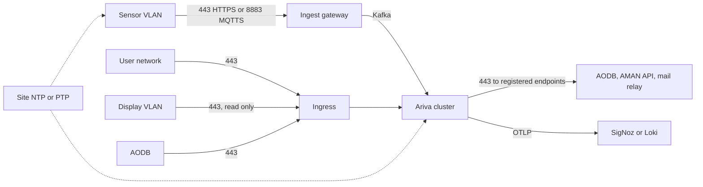

# Network and ports

The network design keeps sensors, displays, users and external systems in separate zones, with no inbound internet anywhere and no route from the airport side into the border network. This page gives the firewall matrix, time synchronisation, TLS and bandwidth figures for a site's network team and the local integration partner.

## Network zones

| Zone | Contains | Rule |
|---|---|---|
| Sensor VLAN | Overhead sensors, PoE switches, the Ingest gateway's sensor-facing interface, the MQTT broker | The gateway is the only bridge to the rest of Ariva. No other route in or out. 802.1X on switch ports. Vendor cloud connectivity disabled at government sites |
| Display VLAN | Passenger display players and signage | Reads only the read-only display endpoint and display pages |
| User network | Supervisors, duty managers, handler staff, administrators | Reaches Ariva only through the ingress on 443 |
| Cluster network | Ariva pods, PostgreSQL, Kafka, Redis | Internal service traffic; mutual TLS or network policies between services (D5) |
| Integration zone | AODB, AMAN, mail relay, airport apps | Inbound only to the Integration API through the ingress; outbound only to registered endpoints |
| Management | Kubernetes API, registry, monitoring, Dalil support access | Administrators only; Dalil support tooling pulls health telemetry only where the customer allows |

## Firewall matrix

Ports marked "check the vendor datasheet" depend on the device family. Rows marked Proposed or To confirm are not yet fixed.

| # | Source | Destination | Port and protocol | Purpose | Status |
|---|---|---|---|---|---|
| 1 | Sensors (sensor VLAN) | Ingest gateway | TCP 443, HTTPS | Webhook push of tracks, counts and health; per-device credential, TLS, source IP allowlist, 256 KB body limit | Decided |
| 2 | Sensors | MQTT broker inside Ariva.Api.Ingest (ARV-024) | TCP 8883, MQTT over TLS | Publish only, with the device code and credential (optional pinned client certificate); topic ACL per device; source networks per device; no subscriptions. Kubernetes: `api-ingest-mqtt-service` | Decided (embedded broker) |
| 3 | Ingest gateway | Sensors or perception platform | TCP 443 HTTPS (REST pull); WebSocket port per vendor | Configuration and health pull; perception platform streams. Only registered device addresses | Port per vendor: check the vendor datasheet |
| 4 | Sensors or analytics servers | Ingest listener | TCP or UDP stream, port per adapter | Length-prefixed frames, source address allowlist | Planned families only |
| 5 | Sensors | Ingest file drop | TCP 22 (SFTP) or FTPS | Interval file upload | Planned families only |
| 6 | Sensors | Site time source | UDP 123 (NTP); UDP 319 and 320 (PTP, IEEE 1588) | Clock synchronisation | Decided (NTP or PTP per device) |
| 7 | Ingest gateway | Kafka | TCP 9092 in the current settings | Publish canonical events; disk buffer while unreachable | TLS listener and port To confirm |
| 8 | AODB, immigration systems, sensor gateways | Ingress, Integration API | TCP 443, HTTPS | Integration API v1 and AIDX push; source CIDRs allowlisted per client | Decided |
| 9 | Ariva Integration | AODB, ACRIS APIs, AMAN Integration API, vendor AODB APIs | TCP 443, HTTPS | Outbound pulls to registered `OutboundEndpoint` records only; resolved IP must be inside the endpoint's allowed CIDRs; no redirects | Decided |
| 10 | AMAN | Kafka topics `aman.feed.*.v1` | TCP 9092 (shared or bridged cluster) | AMAN aggregate feed, border deployments only; prefix ACLs | Decided topics; port and TLS To confirm |
| 11 | Border Integration | Airport Integration | TCP 443, HTTPS with mutual TLS | One-way lane-level feed, pushed from the border side | Proposed, To confirm |
| 12 | Users | Ingress: Web and Main (including the SignalR WebSocket on `/hubs`) | TCP 443, HTTPS and WSS | Dashboards, configuration, live push | Decided |
| 13 | Display players (display VLAN) | Ingress: display pages and read-only display endpoint | TCP 443, HTTPS | Kiosk display pages | Decided |
| 14 | Airport apps, FIDS vendors, signage CMS | Ingress, Integration API | TCP 443, HTTPS | Wait-times API (`queues:read`), display content (`displays:read`) | v1 for the wait-times API |
| 15 | Ariva Integration | Mail relay | SMTP with STARTTLS (587) or implicit TLS (465), per relay; clear text only to smtp4dev in development (2525) | Alert email (ARV-040); only Integration connects to the relay | Site value To confirm |
| 16 | Ariva Integration | SMS gateway, operations-centre webhooks | TCP 443 | Alert channels | v1 |
| 17 | Ariva pods | PostgreSQL | TCP 5432 | Database | Decided |
| 18 | Ariva pods | Redis | TCP 6379 | Cache, backplane, idempotency | Decided |
| 19 | Ariva pods | OTLP collector (SigNoz) | TCP 4317 (OTLP gRPC) or 4318 (OTLP HTTP) | Traces, metrics, logs | Endpoint per site |
| 20 | Cluster nodes | Site NTP | UDP 123 | Server time | Decided |
| 21 | Cluster nodes | Registry (Dalil ACR or Harbor mirror) | TCP 443 | Image pulls | Decided |
| 22 | Administrators | Kubernetes API, Cronz TickerQ dashboard | Kubernetes API port per cluster; TCP 443 | Operations | Restrict to the management network |
| 23 | Dalil support tooling | Health telemetry | Mechanism To confirm (for example a customer-approved VPN) | Device status, lag, error rates only; never operational data | To confirm per customer |

Notes:

- The chart publishes Main, Ingest, Cronz and Integration through the same ingress controller today. Keep the Ingest host off the user network (Target procedure, implemented in Phase 0 epic Device gateway and simulator) and the Cronz host on the management network only.
- Nothing listens for inbound internet traffic. Outbound internet is not needed at run time; image pulls go to the registry or a local mirror.

## Time synchronisation

Waits are differences between timestamps taken at different sensors, and every number is computed in event time. Clocks therefore matter as much as coverage.

| What | Requirement |
|---|---|
| Servers and Kubernetes nodes | NTP to the site's time source. Ariva stores UTC and uses `TimeProvider.GetUtcNow()` everywhere, never local server time |
| Sensors | NTP or PTP, recorded per device as its clock source. Timestamps are taken at the sensor, never at ingestion |
| Integration clients | NTP. TOTP uses a 30-second step with one step of tolerance either side, and JWT validation allows 30 seconds of skew; a client clock that is off by more than 30 to 60 seconds (depending on where in the step it falls) starts failing authentication |
| AMAN | AMAN coarsens its timestamps to the publishing interval; interval records are aligned to the minute |

Clock offset tracking (F19): Ingest computes each sensor's offset against the site reference from `DeviceHealth` (every 10 to 30 seconds).

| Condition | Behaviour |
|---|---|
| Offset within 500 ms (an assumption to tune) | Normal |
| Offset above 500 ms and stable (standard deviation of the last 10 readings below 50 ms, Proposed) | The offset is subtracted from the sensor's timestamps and the data is flagged `Degraded` |
| Offset above 500 ms and not stable | The sensor is marked `Degraded`; waits across that sensor's boundaries are unreliable; alarm to resynchronise |

Examples from the formula tests: offsets 620, 610 and 630 ms are stable and corrected; 100, 900 and 300 ms are not stable and the sensor is degraded. See the [runbook](10-Operations-Runbook.md) procedure for clock drift.

## TLS everywhere

| Hop | Today (repository) | Target |
|---|---|---|
| Users, displays, integrators to the ingress | HTTPS at the ingress controller; the chart has no `tls` section, so the controller's default certificate applies | Site certificate per host (see [Deployment guide](04-Deployment-Guide.md)) |
| Ingress to pods, pod to pod | HTTP inside the cluster (Service port 80 to container port 8080) | Mutual TLS or network policies between services (D5) |
| Sensors to Ingest | Specified: HTTPS push, MQTT over TLS with the device credential (client certificates optional, pinned) | As specified |
| Services to Kafka | Plaintext `kafka:9092` in the current settings | TLS and per-service ACLs (CWE-269 control); configuration To confirm |
| Services to PostgreSQL | `Database:UseEncryption` is `false` in the committed settings | Encrypted connections in production |
| Services to Redis | Plain `redis:6379` | TLS To confirm |
| Outbound integrations | HTTPS only (HTTP only for allowlisted lab hosts); optional client certificate and pinned CA per endpoint | As specified |
| Border to airport feed | Not built | HTTPS with mutual TLS (Proposed) |

Data at rest is encrypted (D5); secrets live in Kubernetes secrets or a vault.

## Segmentation recommendations

1. Put every sensor and its PoE switch on a dedicated sensor VLAN per terminal, with the Ingest gateway as the only bridge. Use 802.1X on the switch ports.
2. Give displays their own VLAN that can reach only the display pages and the read-only display endpoint.
3. Keep administration interfaces (Kubernetes API, TickerQ dashboard, registry, monitoring) on a management network.
4. At a combined site, run the border and airport deployments in separate networks; allow only the one-way feed from the border Integration host to the airport Integration host.
5. If Ariva shares AMAN's cluster, use its own namespace, network policies, database and Kafka prefix ACLs.
6. Disable the vendor cloud features of sensors and perception platforms at government sites.

## Bandwidth estimates per sensor tier

Estimates of the application payload per sensor, before TLS and protocol overhead. Based on D5's assumption of about 100 bytes per sample. Confirm with the vendor and measure in the lab.

| Tier | What is sent | Estimate per sensor |
|---|---|---|
| T3 Tracks | Track samples: people in view x 2 to 5 Hz x about 100 bytes | 30 people at 5 Hz: about 15 KB/s (about 120 kbit/s) |
| T2 Occupancy | Zone occupancy updates plus line counts | Small; a few hundred bytes per update (Estimate) |
| T1 Counts | Interval counts per line | Negligible; a few hundred bytes per interval (Estimate) |
| T4 On-device KPIs | Queue KPIs per interval | Negligible (Estimate) |
| Health | `DeviceHealth` every 10 to 30 seconds | Negligible |

Site totals (D5): 100 sensors at 30 people and 5 Hz are about 15,000 messages and 1.5 MB per second into the gateway, trivial for a local LAN and Kafka. Size uplinks from the sensor switches for the peak, add headroom for firmware downloads during maintenance (size per the vendor datasheet), and keep the AMAN, AODB and border-to-airport flows (aggregates only) in mind as small by comparison.
